# Kubernetes on Zadara: Documentation

This documentation describes how users may deploy their own Kubernetes cluster on top of the Zadara cloud and utilize its built-in integrations with various cloud services. 


## Background

Apart from being the de-facto standard for container orchestration, Kubernetes is often described as “the Operating System of the Cloud”, a term which expresses the fact that more than any other application, it utilizes the power of the cloud by interacting with its core services but at the same time abstracting the cloud’s API with the Kubernetes API.

Such masking of the cloud-level services with Kubernetes-level resources enables users to focus on their application-level needs rather than the specific cloud specifications - this is the root capability beneath the multi-cloud methodology, but even for single-cloud use-cases Kubernetes becomes the platform of choice for developers which no longer need to know the details of the cloud which runs their workloads. 


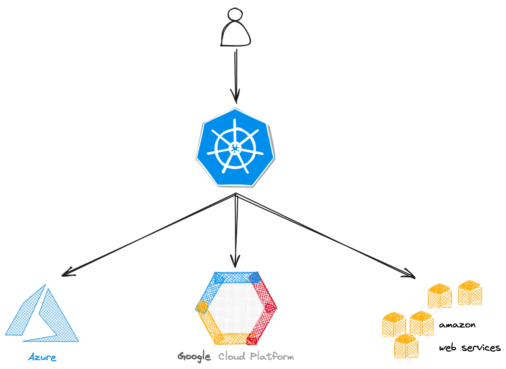


Equipped with native compute, load balancing, storage and even dynamic scaling cloud integrations, Kubernetes users enjoy the power of the cloud without having to directly interact with it. In this documentation we will explore these benefits on top of the Zadara cloud using well-known Kubernetes artifacts, industry-standards deployment tools, and best-practices usage procedures. 


### Kubernetes on Clouds

Keeping in mind that Kubernetes is not a regular application but rather a complex platform, consisting of many different services and encompassing various aspects of containerized application delivery (with and without direct relation to cloud services), it has become apparent that mastering it requires quite a lot of learning effort - with regards to usage (the data-plane) as well as internal administration (the control-plane). More specifically and unlike day-to-day Kubernetes usage, the initial deployment of Kubernetes over clouds does require intimate cloud-level knowledge (as well as elevated permissions), so cloud vendors were quick to offer various degrees of managed-Kubernetes offerings, including the following:


<table>
  <tr>
   <td>Offering type
   </td>
   <td>Control-plane
   </td>
   <td>Data-plane
   </td>
  </tr>
  <tr>
   <td>Self-managed
   </td>
   <td>User responsibility
   </td>
   <td>User responsibility
   </td>
  </tr>
  <tr>
   <td>Semi-managed
   </td>
   <td>Cloud responsibility
   </td>
   <td>User responsibility
   </td>
  </tr>
  <tr>
   <td>Fully-managed
   </td>
   <td>Cloud responsibility
   </td>
   <td>Cloud responsibility*
   </td>
  </tr>
</table>


\* Cloud responsibility over the data-plane means the user is not concerned with the underline compute resources for their workload (only on the pod-level specification). 

In addition, while Kubernetes was the first Cloud-native application (donated by Google to be the first [CNCF project](https://www.cncf.io/projects/kubernetes/) in 2016), its cloud API integrations matured over the years from in-tree support baked within its source code into externally supported tools per cloud vendor and services. For example, the Kubernetes built-in AWS cloud support was removed in version 1.26 (and for all other cloud vendors in [version 1.29](https://kubernetes.io/blog/2023/12/14/cloud-provider-integration-changes/)), so the basic cloud integration component (Cloud Controller Manager) needs to be deployed separately from the core Kubernetes components. This paradigm shift affects other areas as well, such as storage and load balancing - as they now require dedicated external utilities to handle cloud-specific APIs. 

As a result of this change, cloud vendors are using downstream distributions of the original Kubernetes project, bundling their specific cloud’s tools together with the vanilla Kubernetes artifacts to create a streamlined experience for their cloud. 


### Kubernetes on AWS

After years of users running self-managed Kubernetes deployments and workloads on top of AWS, in 2018 Amazon [introduced](https://aws.amazon.com/blogs/aws/amazon-eks-now-generally-available/) EKS (Elastic Kubernetes Service) - their semi-managed offering which was also integrated with [Fargate](https://aws.amazon.com/blogs/aws/amazon-eks-on-aws-fargate-now-generally-available/) in 2019 to create a fully-managed offering. 

In 2020 AWS open-sourced [EKS-D](https://aws.amazon.com/blogs/aws/amazon-eks-distro-the-kubernetes-distribution-used-by-amazon-eks/), their own Kubernetes distribution used by EKS, in order to facilitate EKS-like Kubernetes clusters outside of AWS. 


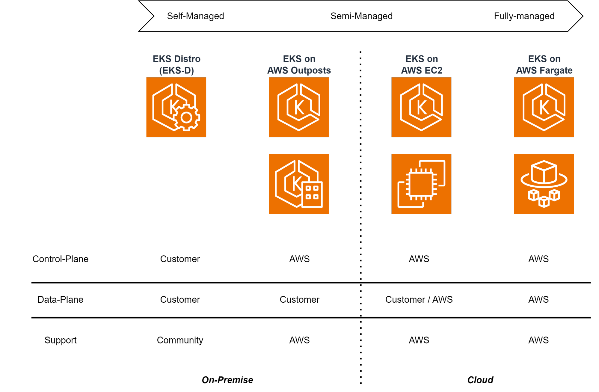


Since EKS-D is the basis for all AWS Kubernetes services, using it ensures you can run the same Kubernetes components both inside and outside of AWS - including other cloud vendors or on-premise locations. Still, you will only get the full EKS-like experience with the AWS cloud, as the AWS-oriented components only work with the AWS cloud API. 


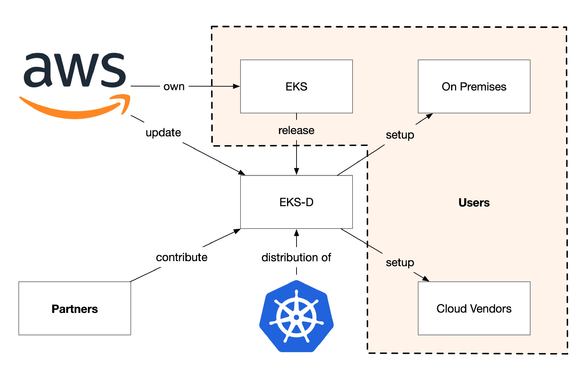


Among others, EKS-D include the below components - all tested by AWS and validated to work with EKS in a consolidated versioned bundle:


* Core components (like APIServer and ETCD)
* Basic plugins (like CoreDNS and kube-proxy)
* CSI components (like external-provisioner and external-attacher)
* CSI snapshotting (like snapshot-controller and csi-snapshotter)


### Kubernetes on Zadara

The Zadara cloud differs from public clouds like AWS mostly due to its edge nature - rather than few huge data-centers (regions) we offer hundreds of small-sized edge locations, each of them fully independent, providing either private- or hybrid-cloud capabilities. 


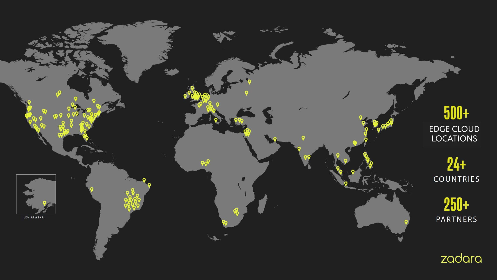


For advanced distributed computing, running your workload on multiple clouds (each one independent yet similar in nature) ensures resiliency and fits the multi-cloud strategy for Kubernetes deployment. One major incentive is that instead of investing in different cloud vendors’ APIs (AWS vs. GCP vs. Azure, etc.), customers can control numerous clouds with the same AWS API. 

Our unique offering enables MSPs as well as end-users with the dynamic nature of public cloud methodologies while preserving the on-premise advantages of tenant-oriented, low latency and direct networking. 


As the Zadara cloud is AWS-compatible by nature, it is a perfect fit for running EKS-D workflows outside of AWS, while enjoying the EKS-like experience with regards to all major cloud integrations. While there are some adjustments to be made (for example with regards to the cloud’s endpoints which are not the AWS ones), Zadara supports the same AWS-oriented utilities such as the [AWS CCM](https://github.com/kubernetes/cloud-provider-aws), the [AWS EBS CSI driver](https://github.com/kubernetes-sigs/aws-ebs-csi-driver) and the [AWS Load Balancer Controller](https://github.com/kubernetes-sigs/aws-load-balancer-controller). Zadara also supports Kubernetes-native tools that support AWS, like the Kubernetes [Cluster Autoscaler](https://github.com/kubernetes/autoscaler/tree/master/cluster-autoscaler) which utilizes the AWS Auto-Scaling Groups API. 

In addition to the EKS-D compatibility, the Zadara cloud supports standard cloud automation tools such as [Terraform](https://www.terraform.io/) (or its new [OpenTofu](https://opentofu.org/) alternative) using the official AWS provider, as well as [Packer](https://www.packer.io/) for AMI-based image building. Such infrastructure-as-code (IaC) approach enables our users to create complex yet consistent architectures for various teams and customers, which is a key attribute in any self-managed Kubernetes deployment. 

Over the last few years we’ve utilized our built-in capabilities to create various reference architectures for different Kubernetes solutions - including Vanilla (original Kubernetes), RKE2 (Rancher-based distribution) and more recently EKS-D itself. We’ve seen several of our customers constructing their own Kubernetes services following these instructions, and we feel like EKS-D is the right approach for Kubernetes on top of Zadara as it benefits the most from our AWS compatibility. 


## EKS-D solution

Accommodating zCompute version 23.08 and above, Zadara is offering an highly-customizable solution for a self-managed EKS-D cluster automated deployment. 


### Solution overview

Starting from zCompute version 23.08 and above (operating in VSC-mode), Zadara is offering an highly-customizable solution for a self-managed EKS-D cluster automated deployment. 

The EKS-D solution is based on the below key elements:


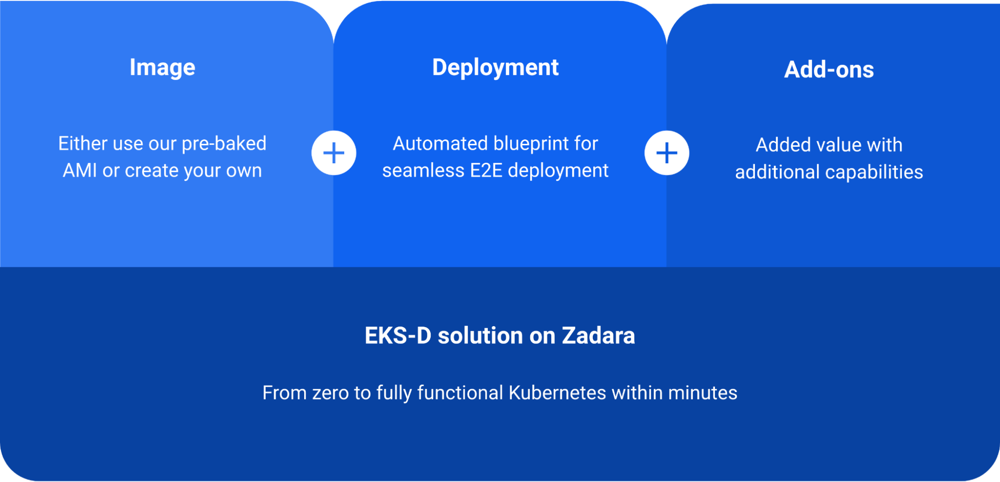


The first element is the EKS-D VM image, which contains all of the Kubernetes prerequisites, EKS-D artifacts and relevant customization features. Zadara follows the same methodology as EKS does by pre-baking these images (one for each EKS-D major release) into AMIs and offer them in each cloud’s image Marketplace, while also providing the actual baking script as an open-sourced [Packer project](https://github.com/zadarastorage/zadara-examples/tree/main/k8s/eksd/eksd-packer) - so customers may review our image-making process and even create their own AMI based on their specific needs. 

The second element is the [automated deployment script](https://github.com/zadarastorage/zadara-examples/tree/main/k8s/eksd), which consists of two Terraform projects (one for the required infrastructure and another for the actual EKS-D deployment) with an optional wrapper script for one-click deployment. The result of running the automated deployment is a running Kubernetes cluster on the Zadara cloud, and a local kubeconfig file for the Kubernetes admin user. 

The third element are the Kubernetes add-ons which are Kubernetes-native applications built into the image and controlled via the automated deployment:


* CNI - networking provider (either [Flannel](https://github.com/flannel-io/flannel), [Calico](https://docs.tigera.io/) or [Cilium](https://cilium.io/) can be used)
* [EBS CSI driver](https://github.com/kubernetes-sigs/aws-ebs-csi-driver) - block storage integration
* [Load Balancer Controller](https://github.com/kubernetes-sigs/aws-load-balancer-controller/tree/main) - load-balancer integration (for both NLB & ALB)
* [Cluster Autoscaler](https://github.com/kubernetes/autoscaler/blob/master/cluster-autoscaler/cloudprovider/aws/README.md) - cluster-level dynamic scaling capabilities
* [Kasten K10](https://www.veeam.com/products/cloud/kubernetes-data-protection.html) - application-level backup & restore capabilities 


We will dive into each of these add-ons in the next sections, but for now just note that while customizable, we enable most of these capabilities by default in order to facilitate their deployment as part of our EKS-D solution, with a ready-to-use out-of-the-box approach. 


### Reference architecture

The below diagram shows the high-level end result of the EKS-D automated deployment, consisting of these components which will be created by the Terraform projects:


* Dedicated VPC to contain the Kubernetes environment (CIDR defaults to 192.168.0.0/16 but can be configured otherwise) 

* Public subnet equipped with Internet-Gateway
    * This subnet hosts a small bastion (jump-server) instance, allowing the user to access the internal subnet’s VMs if needed - by default its security group allows SSH connections from the world, but it can be changed if needed
    * This subnet is also used by the Kubernetes API-Server’s Load Balancer (NLB using port 6443 and targeting the control-plane’s VMs on the private subnet) - by default this NLB will get a public IP but it can be changed to internal-only if needed 

* Private subnet equipped with NAT-Gateway and routing table which leads to the internet through the public subnet’s Internet Gateway (egress-only connectivity)
    * This subnet host both the control-plane (masters) & data-plane (workers) VMs, which are controlled by dedicated auto-scaling groups (each one with its own Launch Configuration and configurable capacity) 

* IAM policies & roles for master/workers VMs, attached to the instances via instance-profiles - by default allowing for EC2, ELBv2 & ASG API usage by both master & worker VMs, but that can be changed if needed 


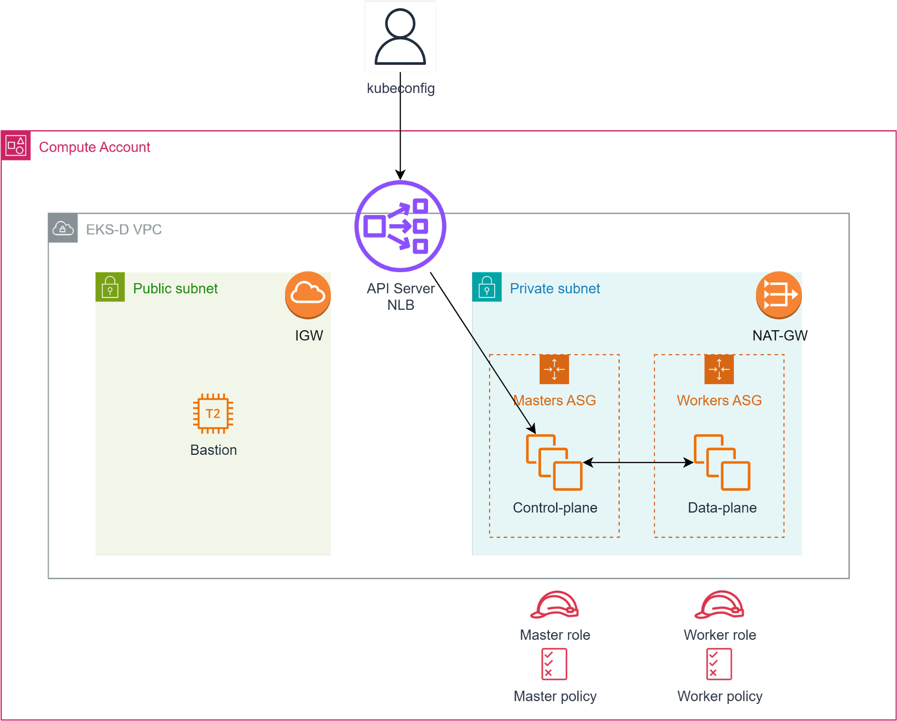


## EKS-D deployment


### Deployment prerequisites

Before running the automated deployment workflow itself and as a one-time preparation, make sure to cover all relevant cloud prerequisites as mentioned in the [zadara-examples](https://github.com/zadarastorage/zadara-examples/tree/main/k8s/eksd) GitHub repository:


* Get the relevant VSC-enabled VolumeType API alias (note this is not the display name) - in most cases this would be “gp2” which is the default value for the deployment, but you can consult with your cloud administrator or run a Symp command as explained in the [documentation](https://github.com/rrsela/zadara-examples/blob/main/k8s/eksd/README.md#zcompute-prerequisites) to validate non-default values 


    
 

* Download the relevant images - the deployment requires the AMI ids of Ubuntu 22.04 (for the bastion host) and your desired EKS-D version (for the Kubernetes master & workers nodes), both of which you can find in the cloud’s Marketplace if not already in your Images list: 


    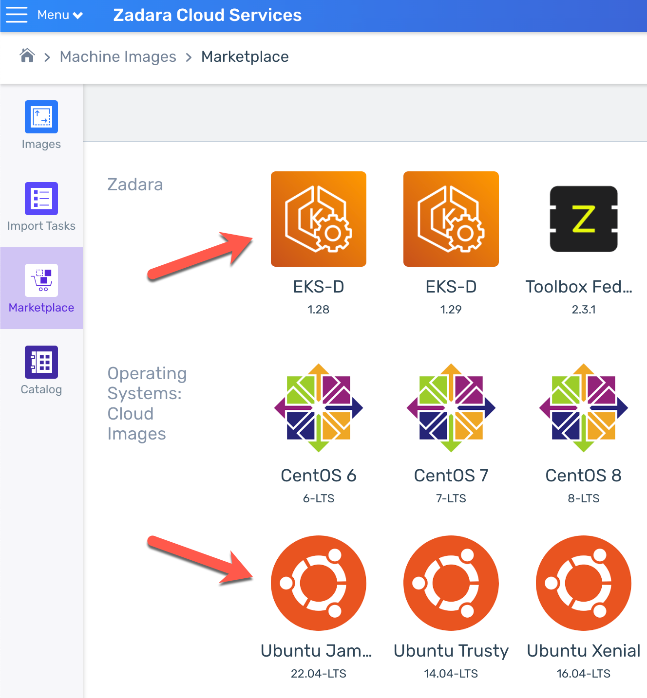

* Create or upload your key-pair/s - these will be used in order to SSH into the bastion, master and worker VMs if necessary (you can use the same key-pair for all, or create different ones): 


    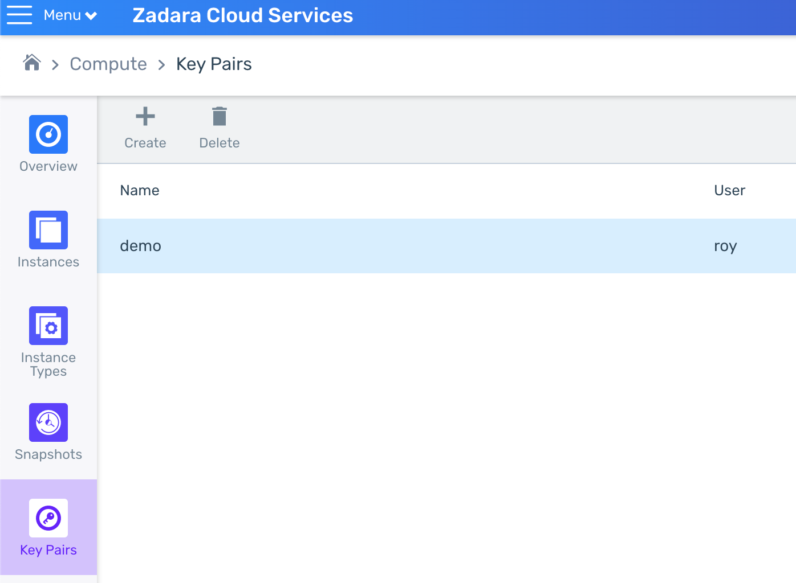

* Create your AWS credentials - save both access & secret keys in a secure location: 


    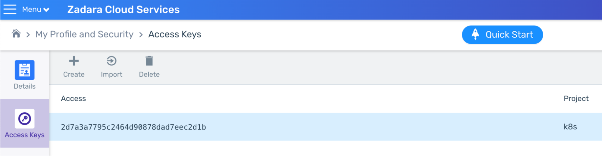


Note your user must have at least _MemberFullAccess_ & _IAMFullAccess_ AWS permissions (or higher one like _AdministratorAccess_) for the relevant project as this is crucial in order to create the IAM resources later on: 


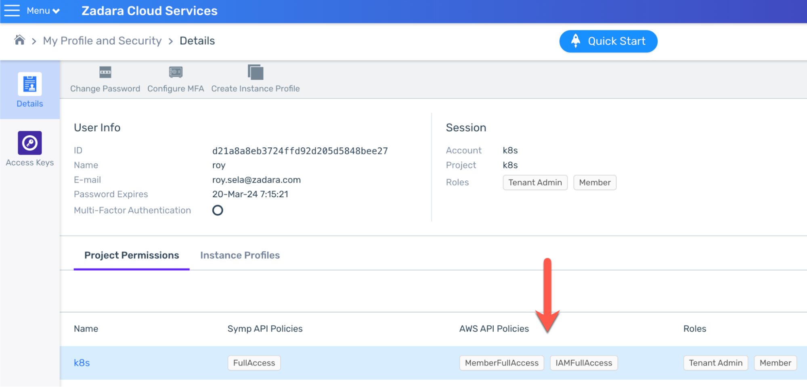


Running the deployment workflow requires a Bash-based executor machine with pre-installed [Git](https://git-scm.com/) as well as [Terraform](https://www.terraform.io/) or [OpenTofu](https://opentofu.org/) that has access to the target cloud. You can also use the Zadara Toolbox image (available in the Marketplace) for such purpose as it already contains both Git and Terraform. 

Once ready, clone the [zadara-examples](https://github.com/zadarastorage/zadara-examples/tree/main) repository and cd into the \k8s\eksd folder to get started with the automated deployment workflow:


```
git clone https://github.com/zadarastorage/zadara-examples.git
cd zadara-examples/k8s/eksd/
```


### Deployment workflow

In most cases, the simplest way to run the automated EKS-D deployment will be the All-in-One wrapper script, which will require only few basic parameters and run both the infrastructure & EKS-D deployment Terraform projects for you, resulting in a running Kubernetes cluster after ~10 minutes and outputting a ready-to-use local admin user’s kubeconfig file. This script can also be used with non-default values as mentioned in the next chapter, but for the sake of simplicity we will run it as-is for now. 

In order to run the automated deployment we will need to follow few basic steps:


1. Copy the `terraform.tfvars.template` file to `terraform.tfvars`
2. Populate `terraform.tfvars` with the relevant information for our environment
3. Run the `apply-all.sh` script with our AWS credentials

Let's review the environment’s setup:


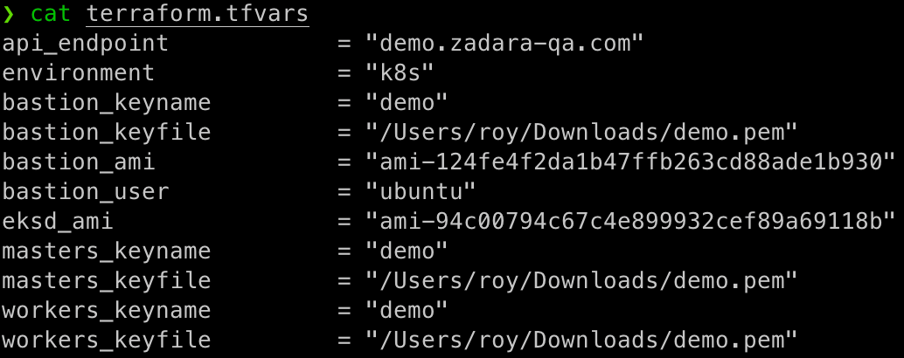


With this configuration, we’re setting the below variables:


* `api_endpoint` - pointing the deployment to my cloud’s base URL  \
(note the project will be implicitly determined by the AWS credentials)
* `environment` - my Kubernetes cluster name (and cloud resources prefix)
* `bastion_keyname` - my key-pair name within the Compute cloud for the Bastion VM
* `bastion_keyfile` - my private key-pair file location on the executor machine
* `bastion_ami` - the Ubuntu 22.04 AMI id as noted in the Compute cloud’s Images list
* `bastion_user` - the Ubuntu 22.04 user name (ubuntu is the default user)
* `eksd_ami` - the EKS-D AMI id as noted in the Compute cloud’s Images list
* `masters_keyname` - my key-pair name within the Compute cloud for the masters VMs
* `masters_keyfile` - my private key-pair file location on the executor machine
* `workers_keyname` - my key-pair name within the Compute cloud for the workers VMs
* `workers_keyfile` - my private key-pair file location on the executor machine

Please note we used the same key-pair in this demonstration for convenience, but you may use different key-pairs for the bastion, masters & workers VMs if needed. Also note the private key-pair location/s must be fully qualified and not relative as required by Terraform. 

Also, make sure both the Ubuntu and EKS-D images are ready (meaning their cloud uploading is finished) within the Compute cloud’s Images list before continuing:


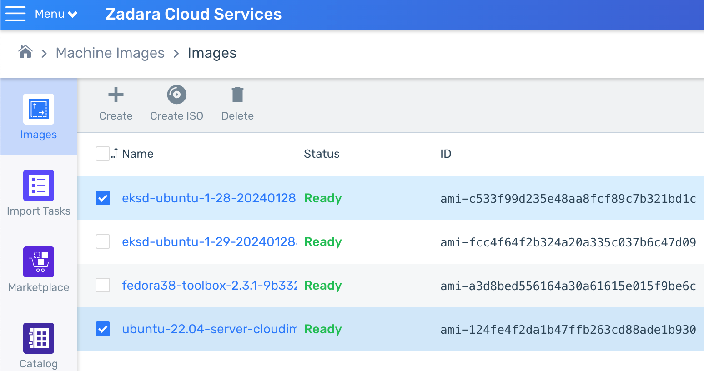


With the configuration all set, we can now run the `apply-all.sh` script with the user’s AWS credentials as arguments, or as I like to do - as implicit environment variables (for increased security):


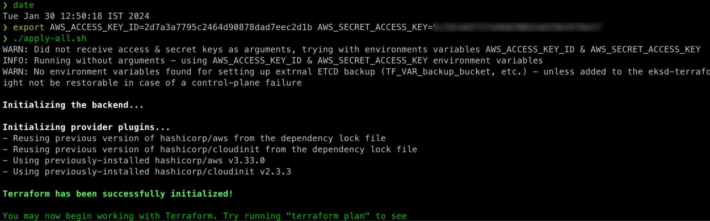


Note the timestamp prior to the invocation, for the default deployment specification the script will run for about 10 minutes and will perform the following operations without prompting the user for any interaction:


1. Initialize & apply the infrastructure deployment Terraform project (creating the VPC, subnets, NAT-GW, NLB, etc.)
2. Use the Terraform outputs to figure out the NLB’s public IP (by running a predefined script on the Bastion VM)
3. Initialize & apply the EKS-D deployment Terraform project (creating the masters/workers ASGs, IAM policies/roles, etc.)
4. Use the Terraform outputs to fetch the initial Kubernetes admin user’s kubeconfig from the first master VM (by running another predefined script on the Bastion VM)

Note that the final phase of obtaining the kubeconfig file should take a few minutes (around 20 retry rounds) for a basic configuration, as the Kubernetes control-plane is bootstrapping. The end result is an output of the kubeconfig file, which is also saved in the working directory:


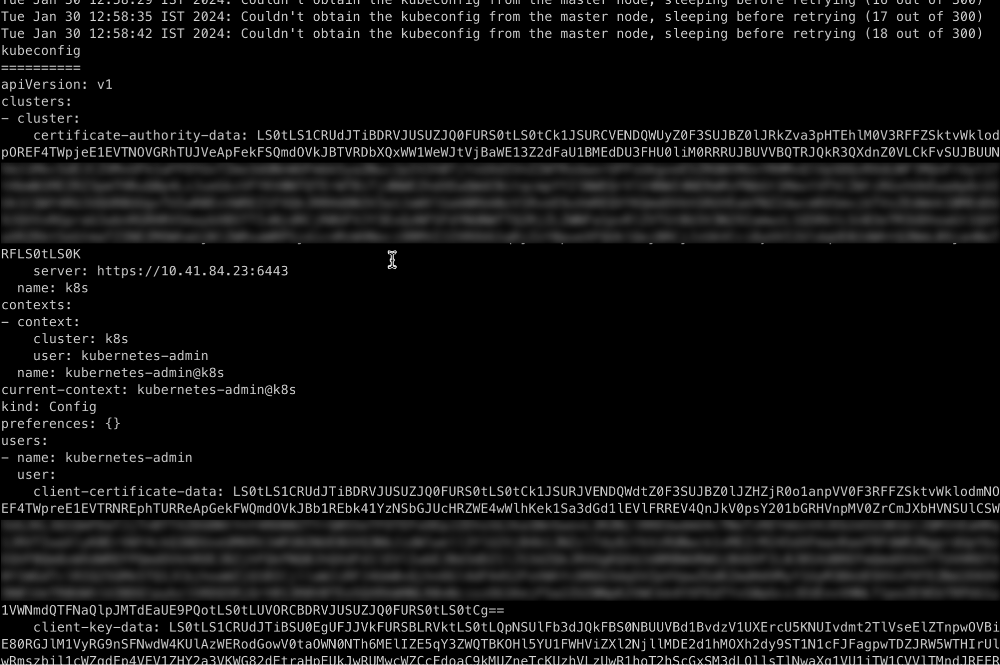


Using this kubeconfig file we can work with [kubectl](https://kubernetes.io/docs/reference/kubectl/) (or any other Kubernetes client, for example [k9s](https://k9scli.io/) or [OpenLens](https://github.com/MuhammedKalkan/OpenLens)) on our newly created Kubernetes cluster:


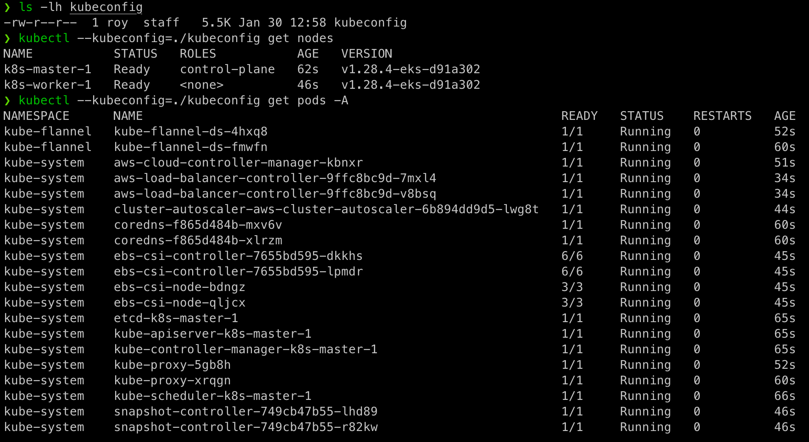


Apart from the CNI, all other addons are deployed using Helm so we can list them, upgrade and potentially manipulate them as needed:


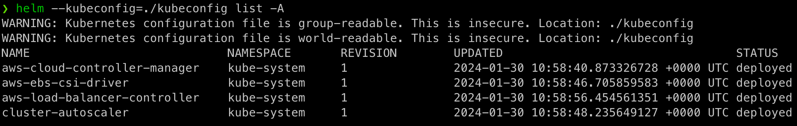


## EKS-D customization

While the above example is great for demonstration purposes, it’s not suitable for production workloads (for example the control-plane is not highly-available, running on a single VM) - further adjustments and various levels of customizations may be required in order to fit different production use-cases.


### Non-default configuration

The All-in-One wrapper script contains only the basic variables in order to facilitate the workflow execution, however the internal Terraform projects support numerous variables for various use-cases and configurations. 

For a complete list of variables check the [infra-terraform](https://github.com/zadarastorage/zadara-examples/blob/main/k8s/eksd/variables.tf) and [eksd-terraform](https://github.com/zadarastorage/zadara-examples/blob/main/k8s/eksd/eksd-terraform/variables.tf) projects’ variable files, below are just few examples:


* `expose_k8s_api_publicly` in infra-terraform - to control whether the API Server’s NLB will be public-facing or not (default is true)
* `vpc_cidr` in infra-terraform - to control the VPC’s CIDR (default is 192.168.0.0/16)
* `masters_count` in eksd-terraform - to control the amount of initial control-plane nodes (set to 3 for an highly-available control-plane)
* `ebs_csi_volume_type` in eksd-terraform - to specify the VolumeType to be used by the EBS CSI (default is gp2)
* `workers_instance_type` in eksd-terraform - to specify the data-plane instance-type (default is z8.large)

Changing the default value of any variable require either changing them inside the relevant project’s `variables.tf` file, or setting them as terraform-based environment variables prior to the execution, for example:


```
$ TF_VAR_masters_count=3 ./apply-all.sh
```


While the environment variable is an easy way to effect the deployment without editing files, please keep in mind that if you do not persist your changed value inside the project, re-running the deployment without the environment variable will override your original value and may have a negative effect on the deployment. 

Another use-case of variable usage is the ability to control the deployment’s optional add-ons as part of the [eksd-terraform](https://github.com/zadarastorage/zadara-examples/blob/main/k8s/eksd/eksd-terraform/variables.tf) variables:


* `install_ebs_csi` - whether or not to install the [AWS EBS CSI driver](https://github.com/kubernetes-sigs/aws-ebs-csi-driver/tree/master) (default is true)
* `install_lb_controller` - whether or not to install the [AWS Load Balancer Controller](https://github.com/kubernetes-sigs/aws-load-balancer-controller) (default is true)
* `install_autoscaler` - whether or not to install the [Cluster Autoscaler](https://github.com/kubernetes/autoscaler/tree/master/cluster-autoscaler) (default is true)
* `install_kasten_k10` - whether or not to install [Kasten K10](https://www.kasten.io/product/?utm_term=&utm_campaign=Blog+Dynamic+Traffic&utm_source=adwords&utm_medium=ppc&hsa_acc=3144319558&hsa_cam=19598062440&hsa_grp=145503929677&hsa_ad=645902390817&hsa_src=g&hsa_tgt=dsa-1053066559429&hsa_kw=&hsa_mt=&hsa_net=adwords&hsa_ver=3&gad_source=1&gclid=Cj0KCQiA7aSsBhCiARIsALFvovwzMddvxuJ1ul_NWwgnCqvCFGOvLs5zQ99tNSreUm769FdOpouW_DwaAs0vEALw_wcB) (default is false)

Unlike the optional add-ons, the EKS-D deployment will also install some mandatory ones implicitly - like the CCM (Cloud Controller Manager) component which is the [AWS Cloud Provider for Kubernetes](https://github.com/kubernetes/cloud-provider-aws/tree/master/docs), the [CoreDNS](https://github.com/coredns/coredns) and [kube-proxy](https://kubernetes.io/docs/reference/command-line-tools-reference/kube-proxy/) which are considered essentials and bundled within EKS-D. You can’t control these add-ons unless you modify the EKS-D image as well as change the [eksd-init](https://github.com/rrsela/zadara-examples/blob/main/k8s/eksd/eksd-terraform/modules/asg/files/eksd-init.template.sh) bash script (which initializes all Kubernetes nodes) - please note this is considered advanced-level customization and will not be covered here.

One last add-on which is not optional but manageable through Terraform is the [CNI](https://kubernetes.io/docs/concepts/extend-kubernetes/compute-storage-net/network-plugins/) (Container Network Interface). This is a core component of Kubernetes that is handling the entire networking stack so the cluster will not initialize without it, but you may decide which CNI implementation to use with your EKS-D cluster out of the supported ones listed below, using the `cni_provider` variable:


* [flannel](https://github.com/flannel-io/flannel) - this is the default CNI, fast simple and reliable layer-3 implementation
* [calico](https://docs.tigera.io/) - this is an advanced multi-layer CNI which adds routing & security features
* [cilium](https://cilium.io/) (experimental support) - this is another advanced multi-layer CNI which is eBPF-native and adds advanced routing, security & observability features

Regarding Cilium, while considered experimental (as we only validate the essential networking functionality as part of our testing procedures) the deployment will also enable the [Hubble UI](https://docs.cilium.io/en/latest/gettingstarted/hubble/) observability feature and you may access it via the [cilium CLI](https://docs.cilium.io/en/latest/gettingstarted/k8s-install-default/#install-the-cilium-cli) by referencing its namespace:


```
$ cilium hubble ui --namespace cilium-system
```


Which will port-forward the hubble-ui service into our localhost, so you can monitor your cluster’s networking traces:


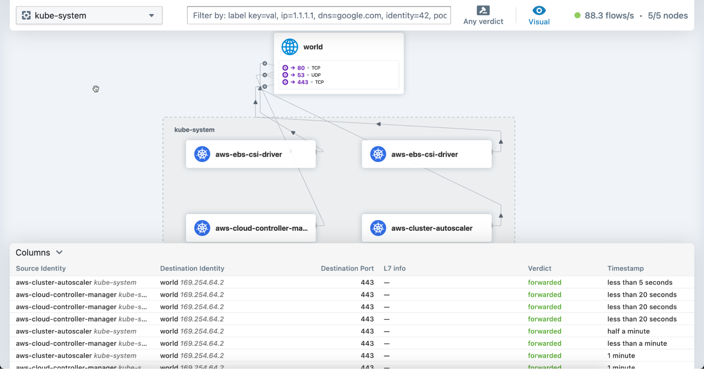


Please note that opting to deploy EKS-D with non-default CNI may require additional resources and downloading as part of the initialization phase, so keep that in mind when considering sizing, etc. 


### Non-default workflow

In some cases, users may need to run the workflow by themselves rather than using the wrapper script. In such case, the workflow can be broken down into the following steps:


* Infrastructure deployment 

    * As an alternative to the `infra-terraform` project, users may deploy their own infrastructure topology either manually, via zCompute’s VPC Wizard or via another cloud automation facility - in such cases please note the below requirements:
        * Any private & public subnet must be tagged according to the [AWS documentation](https://docs.aws.amazon.com/eks/latest/userguide/network_reqs.html#network-requirements-subnets) in order for the AWS CCM/LBC to be able and discover them (note the tags are different for private vs. public subnets)
        * You may use either a public-facing or internal NLB for the EKS-D api-server’s endpoint or skip it completely in case you don’t which to have a Load Balancer, but you will need to provide at least the private IP of the Load Balancer or of your master instance to the EKS-D deployment phase (and potentially also the public IP) 

    * Users running the `infra-terraform` project (or a variation of it) will need to execute the `get_loadbalancer.sh` script from its folder with the relevant parameters (all of which are populated in the terraform outputs):
        * bastion_ip
        * loadbalancer_dns
        * access_key
        * secret_key
        * bastion_user
        * bastion_key 

* EKS-D deployment 

    * As an alternative to the `eksd-terraform` project, users may deploy their own EKS-D clusters either manually or via another cloud automation facility - in such cases please note the below requirements:
        * Any VM must be tagged with `kubernetes.io/cluster/&lt;kubernetes-name>` key and `owned` value in order for the CCM to track its status
        * As a reference example for a manual deployment you may refer to these [manual deployment](https://github.com/zadarastorage/zadara-examples/tree/main/k8s/manual/vanilla) instructions, and further required add-on customizations as listed [here](https://github.com/zadarastorage/zadara-examples/tree/main?tab=readme-ov-file#kubernetes-addons) 

    * Users running the `eksd-terraform` project (or a variation of it) will need to extract the initial kubeconfig specification directly from the initial master VM (located at /etc/kubernetes/zadara/kubeconfig) and if relevant also change the cluster’s server URL from the NLB’s internal IP to the public IP, or execute the `get_kubeconfig.sh` script from the project’s folder with the relevant parameters (all of which are populated in the terraform outputs):
        * master_hostname 
        * apiserver_private 
        * apiserver_public 
        * bastion_ip 
        * bastion_user 
        * bastion_keypair 
        * master_user 
        * master_keypair


### Image customization

While Zadara provides several pre-baked images of EKS-D in the cloud’s Marketplace, users may wish to use their own customized image for various reasons - maybe they would like to use a specific EKS-D version which Zadara does not provide (for example, version 1.27), modify some add-ons (for example not using the latest version of everything), harden the base OS image for increased security, etc. 

The BYOI (Bring Your Own Image) methodology allows such customization by following the [EKS-D Packer](https://github.com/zadarastorage/zadara-examples/blob/main/k8s/eksd/eksd-packer/README.md) project guidelines, baking the image into a new AMI and afterwards pointing the EKS-D deployment to that customized AMI. In fact, Zadara uses the same Packer project in order to bake our own EKS-D images for the Marketplace, so it is always up to date. 

In case you are building your own image with the Packer project, please note the below as you populate the `.auto.pkvars.hvl` parameter file: 


* Zadara recommends basing the EKS-D image on the latest Ubuntu 22.04 (available in the zCompute’s marketplace) for security & compliance reasons. As we follow the same practice with our pre-baked images, most of the existing scripting inside the Packer project is Debian-oriented (`apt` versus `yum`, etc.) and will not require drastic changes for such Operating System family. The actual AMI id can be found on the zCompute console’s Images panel.  

* You will be required to provide a Debian-based (like the Zadara’s toolbox or plain Ubuntu) bastion VM to be used by Packer in order to create the intermediate VM - make sure you can access this VM with regards to routing table and security group (port 22 for SSH should be allowed) 

* You will be required to provide a pre-existing subnet id to be used by Packer’s intermediate VM - make sure the bastion VM can access that subnet with regards to the routing table (usually it’s best to use the same subnet as the bastion VM). 

As an example for such variable file, see the below example for baking a new EKS-D image:


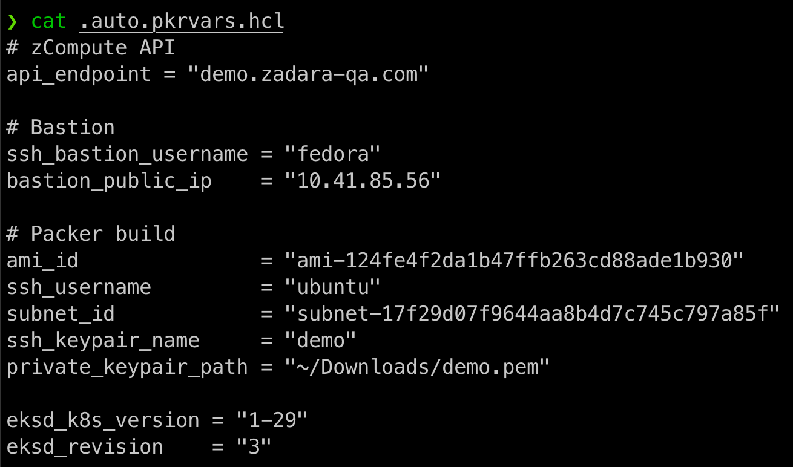


In this example we’re baking the EKS-D image on our demo cloud, using an existing Fedora Zadara toolbox VM with an elastic IP (the bastion’s public IP). The build itself will use the Ubuntu 22.04 AMI on the account’s default VPC & public subnet (note we need the AWS id of the subnet). Most importantly, we’ve asked to bake EKS-D 1-29 release 3, as can be seen in the in the [EKS-D GitHub repository](https://github.com/aws/eks-distro?tab=readme-ov-file#releases) (note this page may change as it always reflect the latest releases):


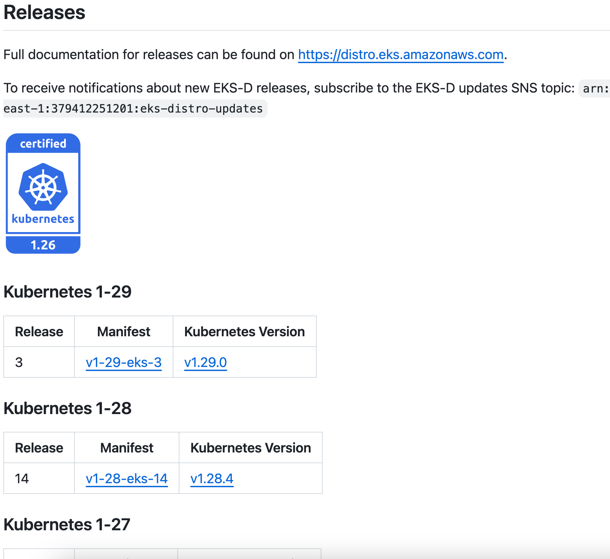


As you initiate the build process with `packer build .` command, note your local AWS profile must point to the relevant zCompute cloud’s AWS CLI credentials (in the below example we’re using an ad-hoc environment variable for that):


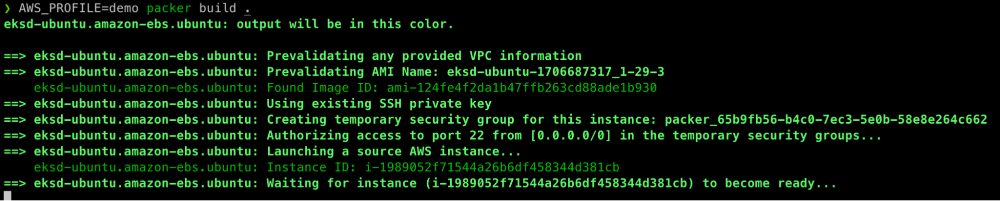


Just in case you are monitoring the build process logs, please note that the below image pull error is expected as kubeadm follows some [naming convention](https://kubernetes.io/docs/reference/setup-tools/kubeadm/kubeadm-init/#custom-images) which the AWS public ECR for EKS-D artifacts [does not follow](https://distro.eks.amazonaws.com/users/install/kubeadm-onsite/#set-up-a-control-plane-node) - this is handled within the script as we pull and re-tag the relevant images afterwards:


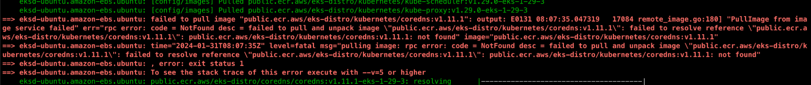


Depending on your content changes, network bandwidth and VM size (default is z8.large), the baking process should take 15-30 minutes to complete, resulting in a fresh AMI:


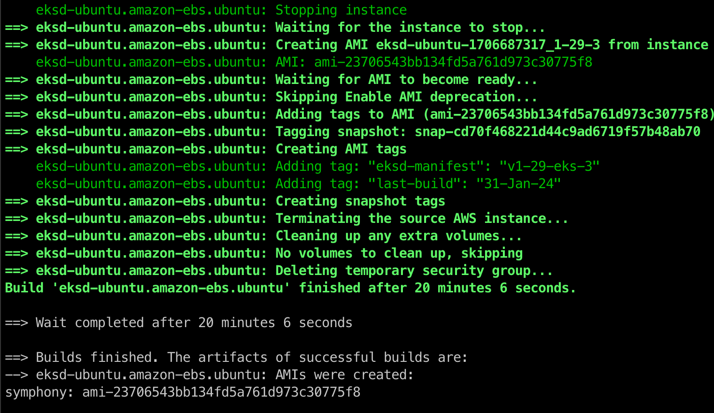


Once over, the new AMI will be available to use within the zCompute consol’s Images panel:


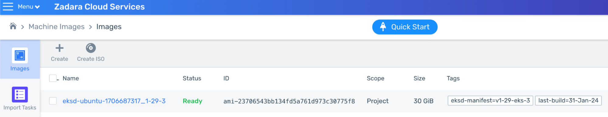


You can then use this AMI id within a regular EKS-D deployment to use your own image. 


## EKS-D Usage

Assuming you have deployed EKS-D using the aforementioned deployment automation, your Kubernetes cluster is ready to use within a minute following the kubeconfig creation, including the relevant add-ons per your configuration. 

The sections below describe some of the most common use-cases for Kubernetes usage in general, and EKS-D in particular. Please note the add-ons themselves may be configured per their documentation to allow further functionality, which may or may not be supposed by the Zadara cloud depending on their API usage. 


### Persistence 

The EKS-D cluster feature an out-of-the-box [AWS EBS CSI driver](https://github.com/kubernetes-sigs/aws-ebs-csi-driver) deployment, with `ebs-sc` pre-configured as the default StorageClass and set to work with the relevant VolumeType of your zCompute cluster (usually this would be gp2):


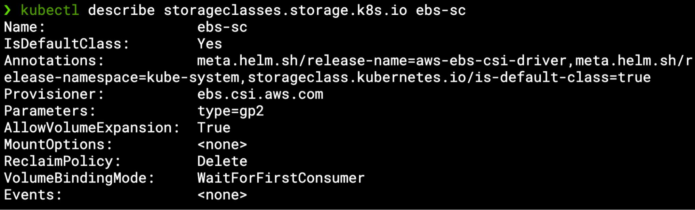


Since `ebs-sc` is the default StorageClass, you do not need to specify its name when creating new PVCs. This can be very handy with Helm charts (in which you only need to enable persistence), but also simplify direct claims like the below YAML spec:


```
apiVersion: v1
kind: PersistentVolumeClaim
metadata:
  name: ebs-claim
spec:
  accessModes:
    - ReadWriteOnce
  resources:
    requests:
      storage: 4Gi
```


With a matching application pod to consume this claim and populate it with timestamps as an example:


```
apiVersion: v1
kind: Pod
metadata:
  name: app
spec:
  containers:
  - name: app
    image: centos
    command: ["/bin/sh"]
    args: ["-c", "while true; do echo $(date -u) >> /data/out.txt; sleep 5; done"]
    volumeMounts:
    - name: persistent-storage
      mountPath: /data
  volumes:
  - name: persistent-storage
    persistentVolumeClaim:
      claimName: ebs-claim
```


Within seconds, the claim deployment will bound to a PV and attach the PVC to the specified “app” pod:


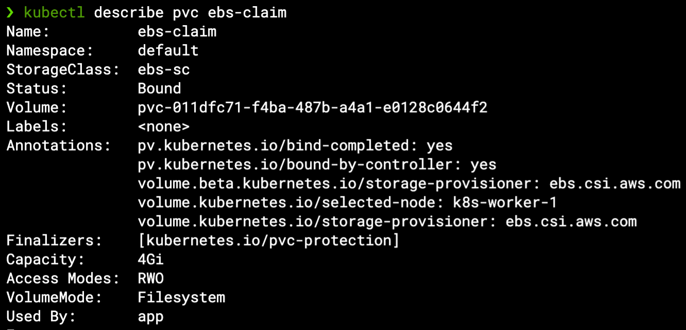


The volume is mounted to the app pod as the “data” folder:


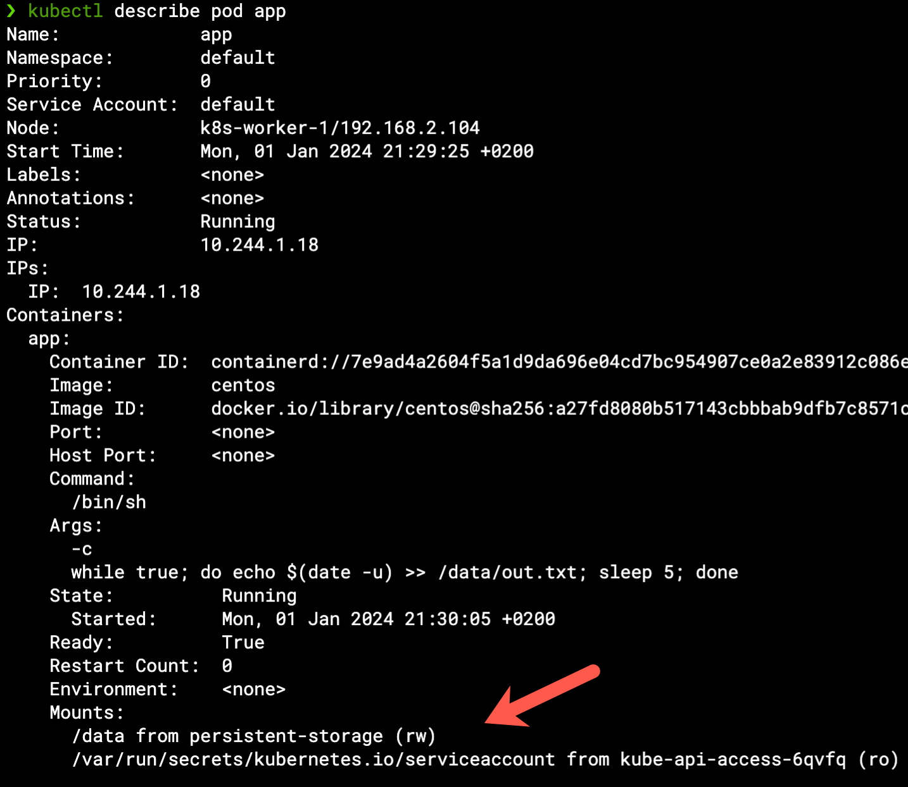


And the data folder is used by the app pod to persist the timestamps:


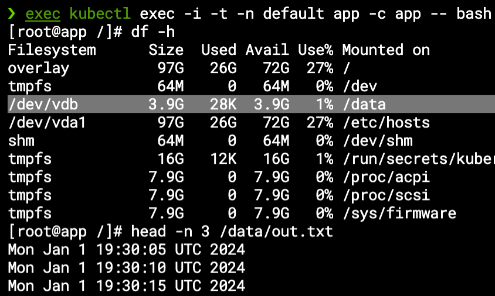


It’s worth mentioning the underline PV is dynamically created on zCompute, attached to the relevant Kubernetes node and represented inside Kubernetes with a matching VolumeHandle:


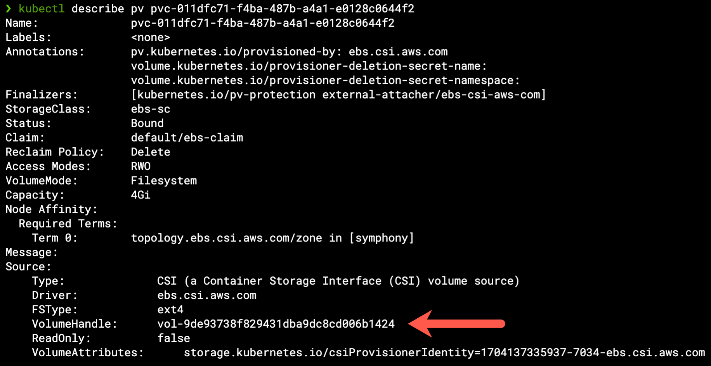


The same volume can be seen directly on the zCompute platform - either via the GUI console, Symp API or AWS API. For example we can use the [aws-cli](https://hub.docker.com/r/amazon/aws-cli) docker image to query the AWS API from the Kubernetes itself using the below command:


```
$ kubectl run -q aws --image amazon/aws-cli --restart=Never --rm -i \
   --command -- /bin/bash << EOF
       yum install -y -q jq
       aws ec2 describe-volumes --volume-id vol-9de93738f829431dba9dc8cd006b1424 \
       --endpoint-url \$(curl -s http://169.254.169.254/openstack/latest/meta_data.json \
       | jq -c -r '.cluster_url')"/api/v2/aws/ec2" \
       --output table
EOF
```


The pod will utilize the Kubernetes node’s instance-profile so no credentials are needed, and will figure out the internal API endpoint so no external communication is needed for the request:


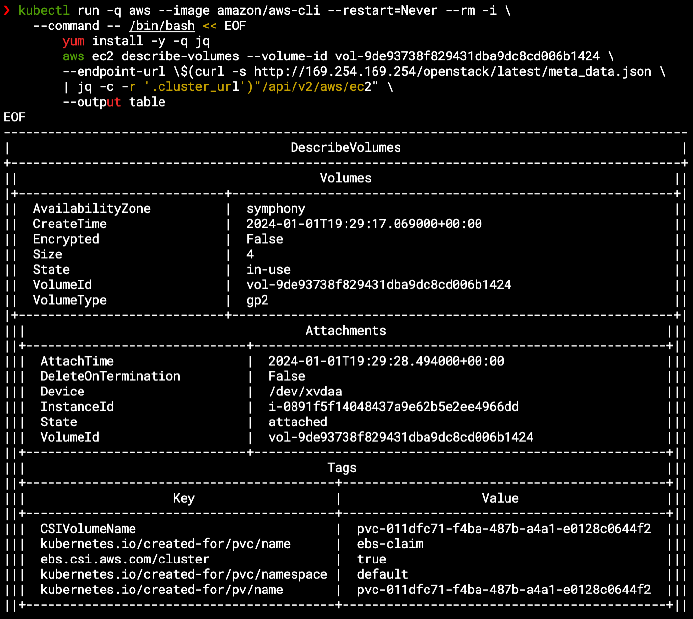


Otherwise, assuming we have a user on the zCompute platform with the relevant permissions, we can also see the volume via Symp API or on the console GUI:


If needed, you may also resize an existing PVC in order to expand the underline volume size, by increasing the PVC capacity request specification - for example:


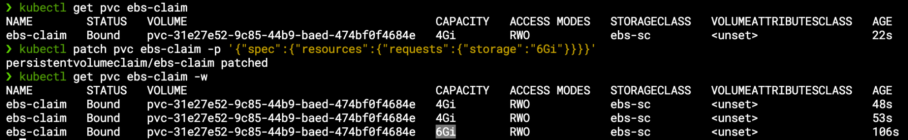


As can be seen in the above example, within a minute the volume capacity was resized as requested - from 4GB to 6GB. 


### Load Balancing

There are two ways that EKS-D can interact with the cloud in order to provide Load Balancing features - either via the CCM (AWS Kubernetes Cloud Provider, which only handles NLB), or via the LBC (AWS Load Balancer Controller, which handle both NLB and ALB). By default, our EKS-D deployment automation provides both components out-of-the-box, however by AWS’s [original design](https://github.com/kubernetes-sigs/aws-load-balancer-controller/releases/tag/v2.5.0) LBC actually overrides CCM with regards to the NLB use-case.

As AWS [recommends](https://docs.aws.amazon.com/eks/latest/userguide/network-load-balancing.html) using LBC over the legacy CCM, and assuming LBC is deployed (by default it is), the below examples will follow the LBC conventions. Please note that In case LBC is not deployed, CCM does require a zCompute cloud-level configuration change in order to create new NLBs (as CCM requires the symphony availability-zone type to be set as regular `availability-zone` rather than the usual `local-zone` that is mandatory for LBC). 

As mentioned before, LBC itself supports two different Kubernetes resource types which correlates to two cloud-level Load Balancer types:


* Service (of type LoadBalancer) - maps to a cloud Network Load Balancer (NLB) handling layer-3 traffic
* Ingress - maps to a cloud Application Load Balancer (ALB), handling layer-7 traffic

While the use-cases may vary (for example, multiple applications can use the same ALB Load Balancer based on different URL paths), it is important to note that LBC is pre-configured as the default controller for both types, so the user should only choose the resource type to deploy (either the Service or the Ingress, or both) and potentially provide the relevant annotations for each of them based on the LBC documentation for [Service](https://kubernetes-sigs.github.io/aws-load-balancer-controller/v2.6/guide/service/annotations/) versus [Ingress](https://kubernetes-sigs.github.io/aws-load-balancer-controller/v2.6/guide/ingress/annotations/). 

Please note that the [default scheme](https://docs.aws.amazon.com/eks/latest/userguide/network-load-balancing.html#network-load-balancer) for any load balancer is internal-facing, so you will be required to provide an additional annotation in order to make it public-facing (with an external IP):


* For Service: \
	`service.beta.kubernetes.io/aws-load-balancer-scheme: "internet-facing"`


* For Ingress: \
`alb.ingress.kubernetes.io/scheme: "internet-facing"`

Another built-in limitation is that a public-facing Ingress also requires at least a [NodePort](https://kubernetes.io/docs/concepts/services-networking/service/#type-nodeport) service to point the cloud’s Load Balancer’s Target Group to.

Other annotations may be relevant for various use-cases (for example, controlling the NLB’s ports, defining the ALB’s application paths, etc.) and not all of them are supported by the Zadara cloud (for example, the IP-level traffic mode is not supported - only the instance-level mode is supported). 

For example, take the below application pod specification (for an NGOS container):


```
apiVersion: apps/v1
kind: Deployment
metadata:
  name: my-app-deployment
spec:
  replicas: 1
  selector:
    matchLabels:
      app: my-app
  template:
    metadata:
      labels:
        app: my-app
    spec:
      containers:
      - name: my-app-container
        image: nginx:latest 
        ports:
        - containerPort: 80
```


In order to create a public-facing NLB for it, the below specification is required:


```
apiVersion: v1
kind: Service
metadata:
  name: my-app-service
  annotations:
    service.beta.kubernetes.io/aws-load-balancer-scheme: internet-facing
spec:
  selector:
    app: my-app
  ports:
    - protocol: TCP
      port: 80
      targetPort: 80
  type: LoadBalancer
```


This will create the below service:


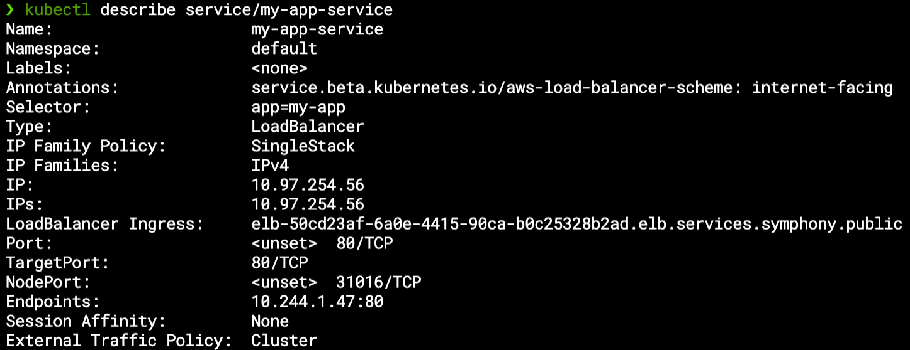


Note the hostname is a public-facing DNS entry which is not really relevant because unlike AWS, the Zadara cloud is not a public registrar - so only the external IP address is relevant in our case. We can validate this external IP via the zCompute GUI console, Symp API or via the AWS API. For example running the below command:


```
kubectl run -q aws --image amazon/aws-cli --restart=Never --rm -i --env PUBLIC_DNS=elb-50cd23af-6a0e-4415-90ca-b0c25328b2ad.elb.services.symphony.public \
    --command -- /bin/bash << EOF
        yum install -y -q jq
        aws ec2 describe-network-interfaces \
        --endpoint-url \$(curl -s http://169.254.169.254/openstack/latest/meta_data.json | jq -c -r '.cluster_url')"/api/v2/aws/ec2" \
        --filter Name=addresses.private-ip-address,Values=\$(getent hosts \$(echo "\$PUBLIC_DNS" | cut -d. -f1) | cut -d\  -f1)  \
        --query 'NetworkInterfaces[0].Association.PublicIp' \
        --output text
EOF
```


Will produce the actual public IP:


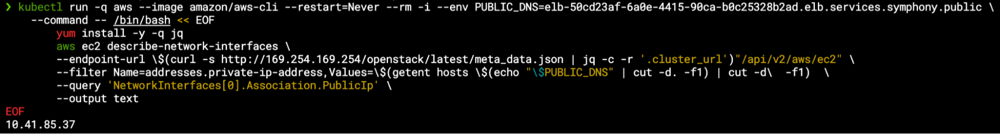


Otherwise if you have a zCompute user the the relevant permissions, you can also see the NLB using the zCompute GUI console:


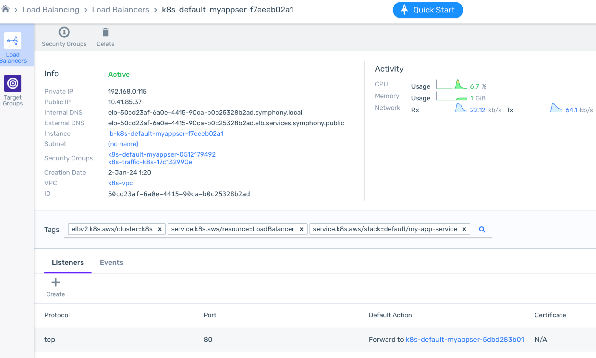


You can also see the TCP Target Group configuration, pointing to the implicit NodePort:


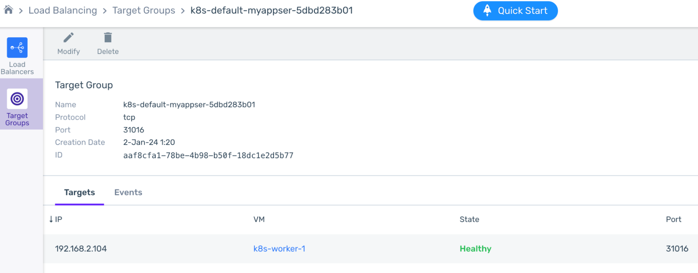


The public IP is pointing to the NLB, which points to the Kubernetes node (over TCP), which points to the Service, which points to the nginx pod:


In order to create a public-facing ALB for the same application, the below specification is required:


```
apiVersion: networking.k8s.io/v1
kind: Ingress
metadata:
  name: my-app-ingress
  annotations:
    alb.ingress.kubernetes.io/scheme: "internet-facing"
spec:
  rules:
  - host: 
    http:
      paths:
      - path: /
        pathType: Prefix
        backend:
          service:
            name: my-app-service
            port:
              number: 80
```


Similarly the Ingress is created but the public DNS entry is irrelevant:


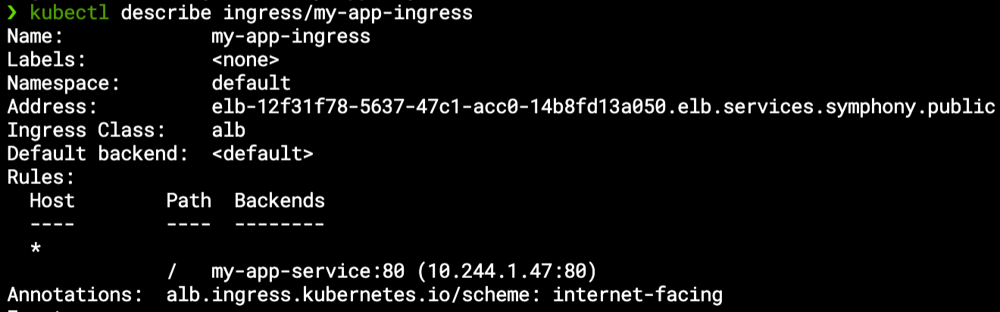


This time, an ALB is created within zCompute:


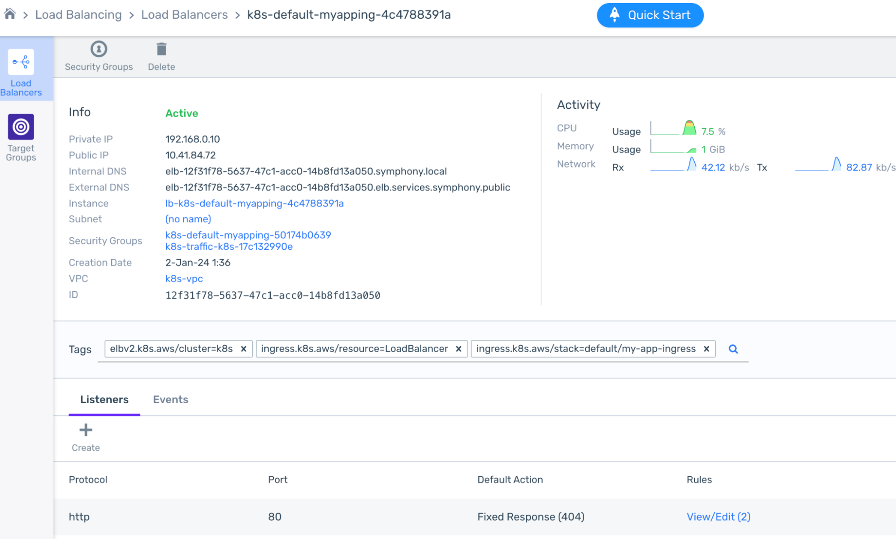


Note the rules can be viewed and/or manually edited from the console:


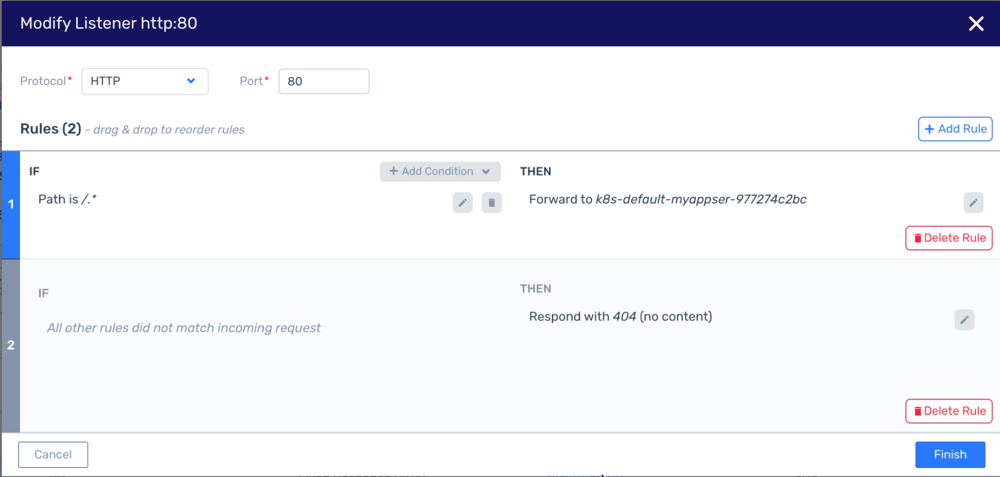


Also note the HTTP Target Group points to the same implicit NodePort as before - if we didn’t have the Service in place we would need to explicitly define it:


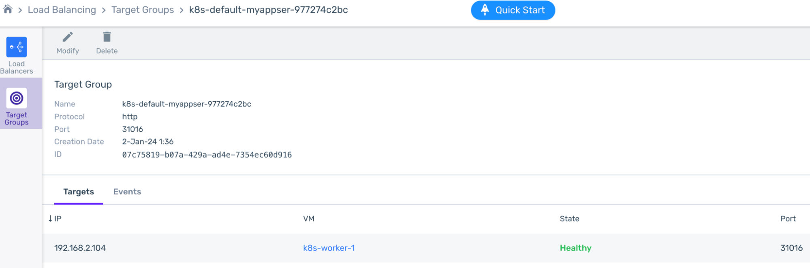


The public IP is pointing to the ALB, which points to the Kubernetes node (over HTTP), which points to the Ingress, which points to the nginx pod:


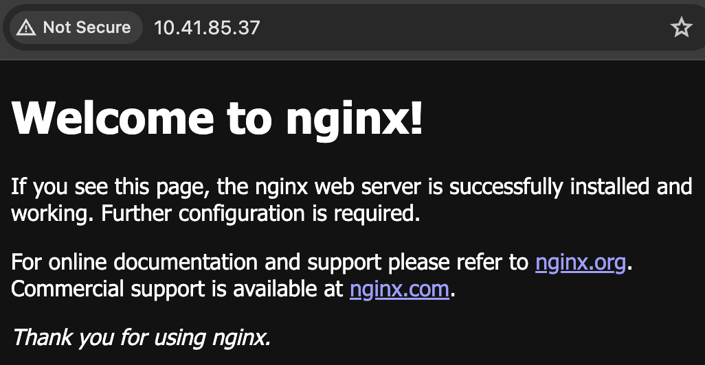


### Workload backup & restore

In addition to the regular block storage abilities, the EBS CSI is also pre-configured with snapshotting abilities, as the VolumeSnapshotClass `ebs-vsc` CRD is already set up as the default snapshotter, and even has been annotated to be Kasten K10 qualified:


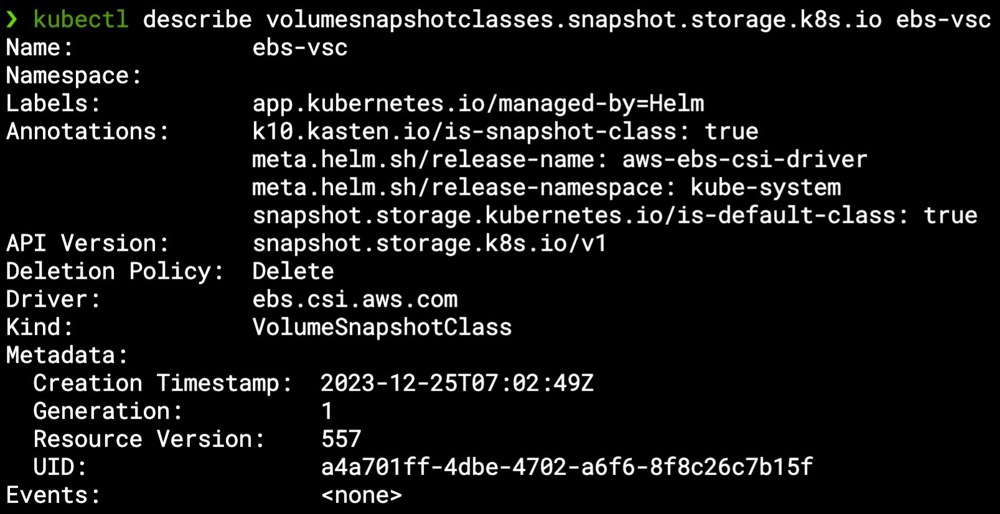


With the snapshotter deployed, you can manually create a VolumeSnapshot of any given PVC using something like the below YAML specification:


```
apiVersion: snapshot.storage.k8s.io/v1
kind: VolumeSnapshot
metadata:
  name: ebs-volume-snapshot
spec:
  source:
    persistentVolumeClaimName: ebs-claim
```


This will create a snapshot of a pre-existing `ebs-claim` PVC resource, ready to use within seconds (actual time depends on the original volume size):


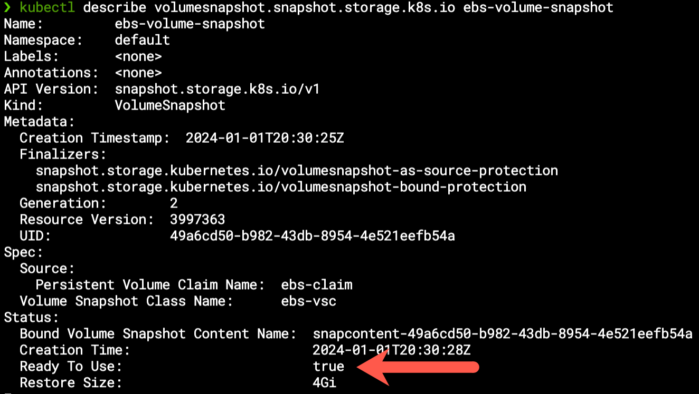


With this snapshot, you will be able to recreate a PVC based on it, using something like the below YAML specification:


```
apiVersion: v1
kind: PersistentVolumeClaim
metadata:
  name: ebs-snapshot-restored-claim
spec:
  accessModes:
    - ReadWriteOnce
  resources:
    requests:
      storage: 4Gi
  dataSource:
    name: ebs-volume-snapshot
    kind: VolumeSnapshot
    apiGroup: snapshot.storage.k8s.io
```


It’s worth mentioning that the VolumeSnapshot is bounded to a VolumeSnapshotContent resource, which refers to the actual snapshot resource on the cloud:


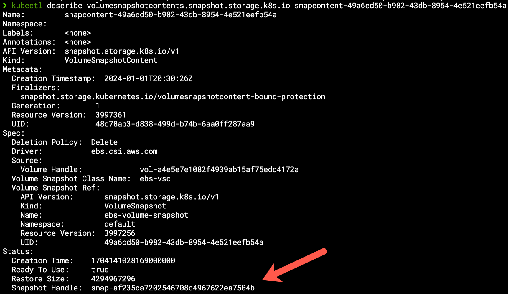


Just like before, you can see the snapshot cloud resource using the AWS API, Symp API or zCompute GUI console:


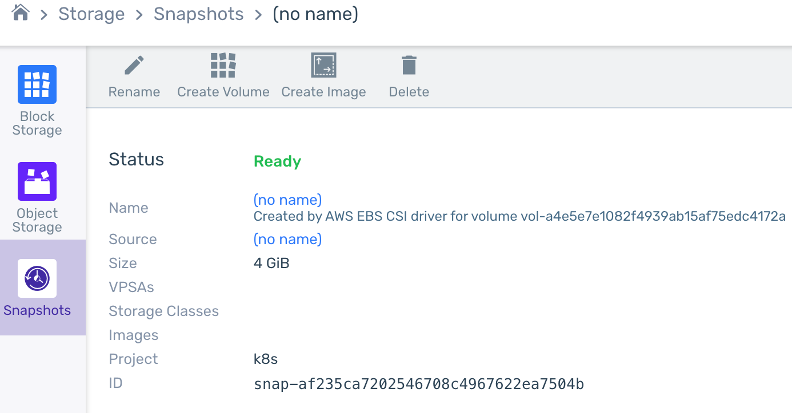


For more advanced backup & restore capabilities, users may consider using [Kasten K10](https://kasten.io/) (which can be deployed out-of-the-box with the EKS-D deployment automation). Among other things it will also cover the application specifications across all relevant Kubernetes resources - so you can backup, restore and even migrate the entire application and not just its data. 

For a basic in-cluster backup & restore solution, you don’t require any further setup - just access K10 GUI by port-forwarding its gateway service:


```
kubectl --namespace kasten-io port-forward service/gateway 8080:8000
```


Alternatively you may want to expose the GUI via a Load Balancer - in such case please follow the [official documentation](https://docs.kasten.io/latest/access/dashboard.html#accessing-via-a-loadbalancer) for Helm chart usage (and note it will require enabling authentication).

Once accessible (note the exact URL would be [http://localhost:8000/k10/#](http://localhost:8000/k10/#)), you will need to accept the Kasten EULA - please be advised that K10 is only free to use for Kubernetes clusters under 5 worker nodes (refer to their [pricing page](https://www.kasten.io/pricing) for more details). 

For this example, I have a running PostgreSQL database which I have installed via Helm in the “pg” namespace:


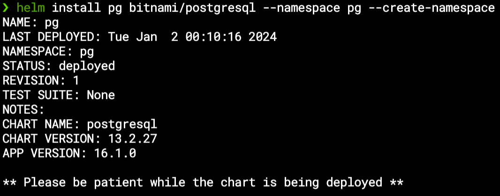


This chart contains several different resources - apart from the StatefulSet itself Helm also deployed the PVC, a Secret (with the admin user’s credentials) and two services for accessing the database:


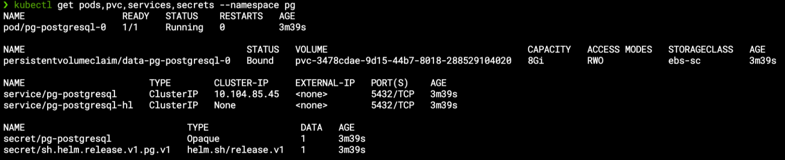


K10 consolidate all these resources under the pg “unmanaged” application (as we do not have a backup policy for it yet):


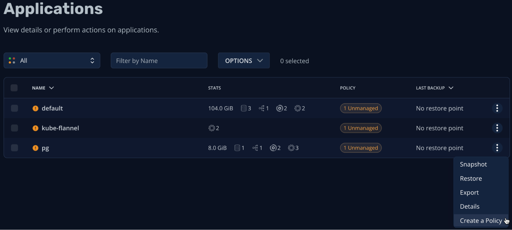


I will now create a backup policy for the pg application - leaving all default values would create a policy which will take a snapshot of the entire application (all resources including data volumes) on an hourly basis:


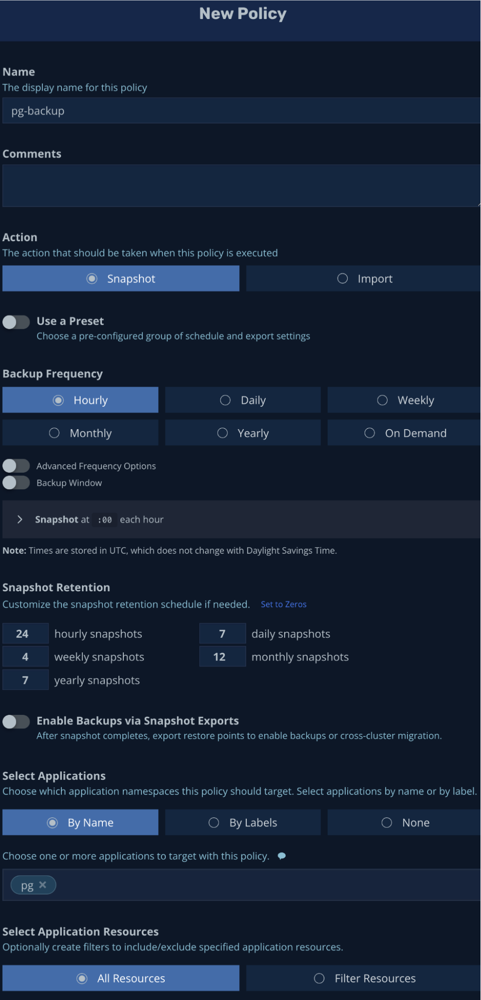


We now have a valid policy (so the application is “managed” by K10) which we can also run on-demand:


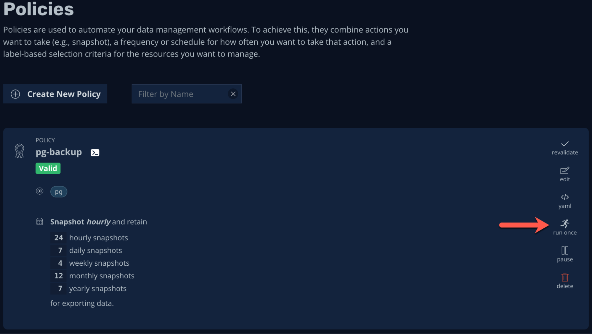


This is the actual backup job (finished within 40 seconds in this simplified case):


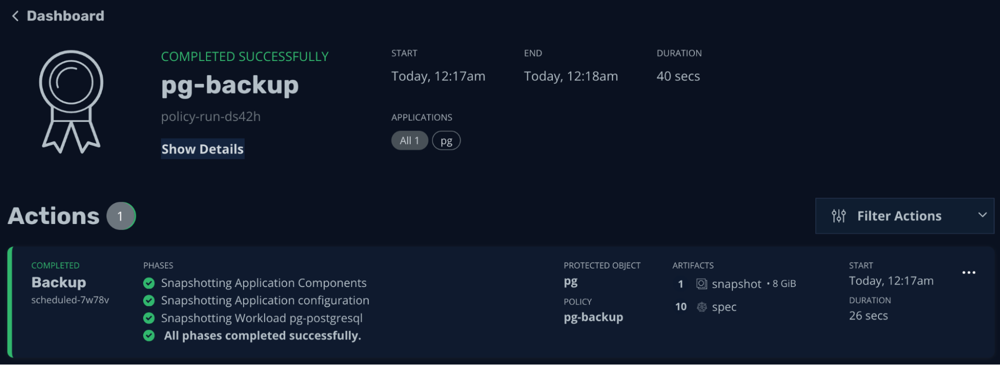


Now that the application is managed and compliant with a backup, I will delete it entirely from my Kubernetes cluster using the Helm uninstall command, and since StatefulSet PVCs are not deleted by default, I will revalidate all the resources are gone by manually delete the PVC:


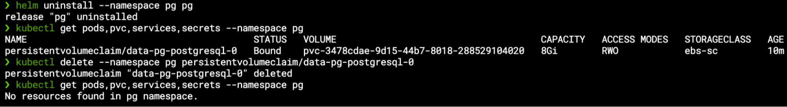


Since the application is managed by K10, I can restore it:


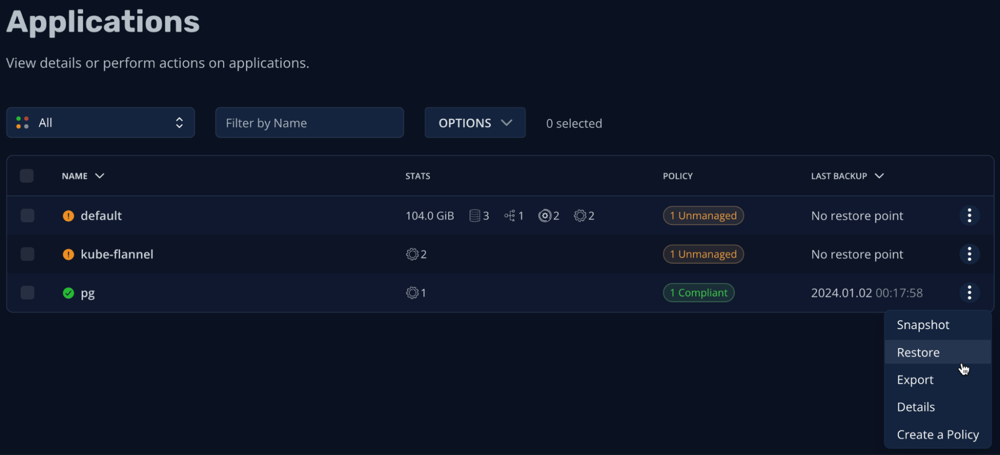


I will be using my one and only restore point in order to restore the backup into the same namespace (can be any other namespace as well):


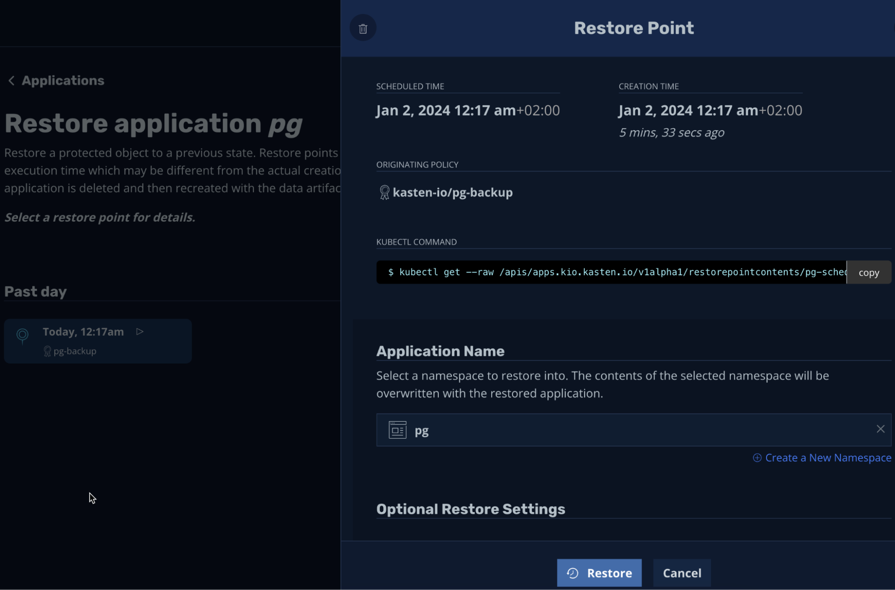


Once the restore job is completed, the application is back online with its original content (new PVC based on the snapshot) and previous configurations - even the Helm annotations are there so Helm think it actually deployed it and we can continue to manage the application using Helm:


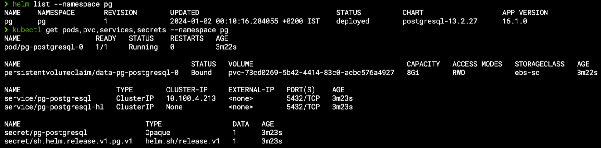
 

Under the hood, K10 uses the same snapshotting practices as mentioned in the original simplified example mentioned in the beginning of this section (we can see the same VolumeSnapshot resources, etc.), however it uses the [kanister](https://kanister.io/) engine to help with various database-oriented use-cases as well as plenty of added functionality to create a great value for Kubernetes administrators looking for an easy way to backup & restore their workloads.

For more advanced use-cases, consider integrating K10 with the Zadara Storage cloud (specifically our S3-compliant NGOS) - by providing the relevant endpoint, region and user credentials you will be able to export your backups outside of the Kubernetes cluster into a remote location, which can serve for hot/cold DR, Ransomware, migration and even Kubernetes-level upgrade use-cases. 


### Dynamic cluster scaling

As the EKS-D deployment is based on ASGs (Auto Scaling Groups) for both the control-plane (master VMs) and the data-plane (worker VMs), the enabled by default [Cluster Autoscaler](https://github.com/kubernetes/autoscaler/tree/master/cluster-autoscaler) component may modify them in order to accommodate for dynamically-changing computation needs. 

Set to use the [auto-discovery](https://github.com/kubernetes/autoscaler/tree/master/cluster-autoscaler/cloudprovider/aws#Auto-discovery-setup) mode on the worker’s ASG, this component will monitor pending pods which require additional worker nodes and increase their capacity accordingly, so within 2-3 minutes a new worker node will join the cluster and the Kubernetes scheduler will direct the pending pod to it. 

Please note there are various configurations to be set in case you do not approve of the default ones - for example see [here](https://github.com/kubernetes/autoscaler/blob/master/cluster-autoscaler/FAQ.md#how-can-i-modify-cluster-autoscaler-reaction-time) how to set the scale up/down delay intervals. You may use the EKS-D pre-defined Helm release and modify its values. 


## Limitations

Please note the below limitations regarding this solution.


### Self-Managed vs managed-solution

Although on our product roadmap, Zadara **does not yet have** a managed-Kubernetes offering. The EKS-D solution is essentially a blueprint and instruction-level examples in order to facilitate the deployment and usage of Kubernetes on top of the Zadara cloud - which means the deployment, operation, administration, monitoring and generally speaking any day-two tasks are to be handled by the customer rather than Zadara. 

One architectural aspect of this self-managed offering is that the control-plane is running internally within the solution, side-by-side to the data-plane. While convenient, it also means that Kubernetes users (especially ones with elevated permissions) may be able to affect the control plane in various ways - override the control-plane taint to run workloads, ssh into the control-plane nodes, etc.

The security implications also include Kubernetes-to-Zadara impact - by default both master & worker nodes receive the same AWS permissions (although they use different AWS instance-profiles & roles), so this may be changed if needed, but essentially users may perform cloud operations through Kubernetes resources - just like an Ingress will create an ALB Load Balancer, users may run free-style aws-cli pods in order to create/delete instances using the Kubernetes identity. For increased security you may want to change the Kubernetes permissions, or make the eksd-terraform project use pre-existing AWS roles/policies ids rather than create them from scratch. 

From an operational perspective, the customer is required to perform various administrative tasks over the Kubernetes cluster - for example handling user-management and certification-management. Please note that all internal Kubernetes/KubeADM certificates are set to a [one-year expiration](https://kubernetes.io/docs/tasks/administer-cluster/kubeadm/kubeadm-certs/) by default, so make sure to follow the instructions for an overall certificate renewal (for example using `kubeadm certs renew all` on the control-plane).

Among other operational tasks, the customer is also responsible for backing up the Kubernetes clusters to avoid any potential data loss. Kasten K10 can help with data-plane application-level as well as cluster-level resources, but in order to recover the Kubernetes cluster from a control-plane failure, the EKS-D solution includes a bi-hourly ETCD backup procedure within every control-plane node - taking a snapshot of the ETCD datastore and saving it locally into `/etc/kubernetes/zadara/etcd_backup_<hostname>_<instance_id>.db`. Please note that unless configured otherwise within the original deployment Terraform project, the backup will remain local-only so in case all control-plane nodes are lost, you might not be able to recover it. Alternatively, you may specify a [Kubernetes secret](https://github.com/zadarastorage/zadara-examples/blob/main/k8s/eksd/README.md#optional-post-deployment-dr-configuration) that will be used in order to export the backup into an external Object Storage location like Zadara’s NGOS or AWS S3 (the export will occur on the next backup cycle) which will help with DR use-cases. 

Regarding upgrades, while the EKS-D solution does not support in-place upgrades, users may re-use the original Terraform project to edit the terraform.tfvars file and change the ASG’s Launch configuration to use a newer EKS-D AMI version. Such re-apply will replace both masters & workers ASGs to use a new Launch Configuration with the updated image, but the user will still need to manually scale the ASGs in order to create new VMs with the updated version. Alternatively you may also update specifically the workers/masters ASG by overriding the relevant variable on the eksd-terraform project (`masters_eksd_ami` or `workers_eksd_ami`), and apply the same scaling method to introduce the new nodes.  


### Production vs. demo

While the out-of-the-box experience of the EKS-D deployment is great for quick demos and POCs, this is by no means a production-grade deployment example. When considering your production environment please make sure the environment is suitable for such workload, for example with regards to the below aspects:


* Scalability - cluster-level as well as pod-level static/dynamic scaling
* Resiliency - highly-available control-plane (minimal 3 nodes for quorum) 
* Security - limited bastion exposure, OS-level hardening, network policies, etc.
* Disaster recovery - control/data-plane backups stored outside of the cluster

There are numerous methodologies for production-grade hardening, and you must choose the appropriate one for your needs. 


### Apply vs. destroy

While you may create (apply) as well as destroy your EKS-D cluster with Terraform (note the `destroy-all.sh` script), please note Terraform will not be able to destroy all of the resources in case you’ve already created additional ones - for example, new LoadBalancer services will block the destroy process as they imply Load Balancers, Security Groups, etc. The same applies for PVCs (especially StatefulSet ones which retain the PVC even after deletion) - if you want to destroy your EKS-D deployment you will need to manually remove all these resources. 
