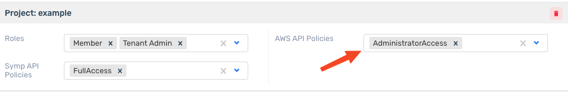
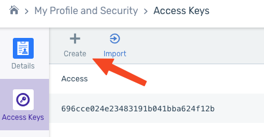
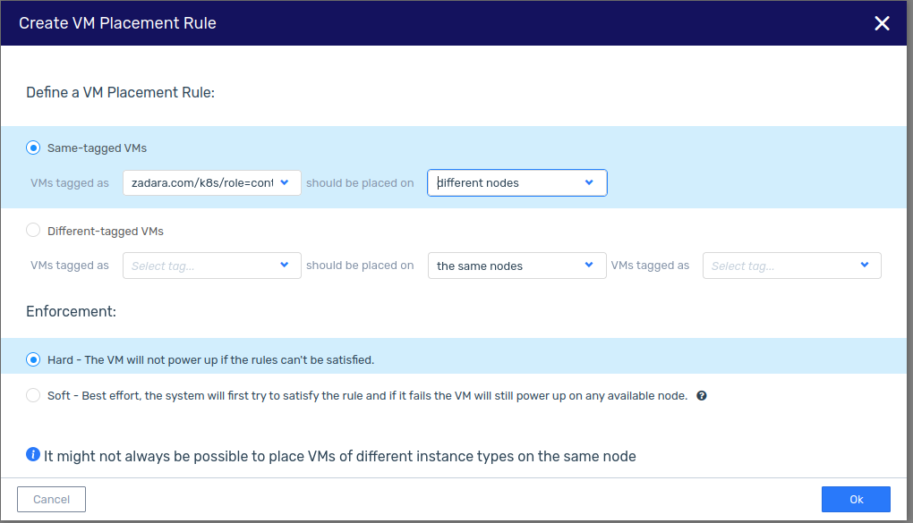

# Preparing zCompute account for use with Terraform

## Introduction

This guide provides a step-by-step approach to setting up your zCompute account with Terraform.
The zCompute Cloud Console includes a variety of APIs that can be utilized with the AWS Terraform Provider.

## Zadara Account Creation

Sign up through the Zadara Provisioning Portal, and/or contact our [sales team directly](https://www.zadara.com/freetrial/).

Then provision a zCompute account in one of our available regions.

## zCompute Account Creation

Begin by signing up through the `Zadara Provisioning Portal`. For personalized assistance, feel free to [contact our sales team directly](https://www.zadara.com/freetrial/).

Next, provision your zCompute account in one of our many available regions to get started. Account resource limits may vary by project and region, so this may be best to discuss with our team.

## Create a dedicated zCompute VPC Project

We recommend separating applications/projects using zCompute Projects, this is where we'd limit the access scope of an `Access Key` to later.

While logged in as a "`Tenant Admin`":

1. In the zCompute UI, go to the **Identity & Access > Accounts** view. Select the account for which you wish to create a project.
2. In the lower half of the account view, select the **Projects** tab and click **Create Project**. The **Create Project** dialog is displayed.
3. Enter the following information:
   1. **Project Name** - enter a name for the new project. The name must be unique within the account. Project names are not case-sensitive.
   2. **Project Description** [Optional] – enter a description of the new project.
   3. **Type** - select the type of project:
      * **VPC** - Virtual Private Cloud project type.
   4. **IP Pool** (VPC-type projects) - select one of the IP pools. If there is no available IP pool, request an administrator to create a shared edge network available in your Zadara Cloud Services region.
   5. **Grant Permissions** - leave the checkbox selected (default) to grant yourself permissions on the new project.
4. Click **OK** to create the new project. The new project is created and is displayed in the **Projects** tab of the specific account.
   * You can switch between any project at any time by selecting it from the dropdown to the top-right of the page

[Zadara Guides - Creating Projects](https://guides.zadarastorage.com/cs-iam-guide/latest/projects.html#creating-projects)

## Create an Access Key

Creating an Access Key is necessary to grant AWS SDK oriented software to utilize zCompute infrastructure.

1. Ensure the user has AWS Administrator API Access for the desired project
   1. Under `Account > Users`, Highlight the user in question, then click `Manage Permissions`.

      

      **Note**: This cannot be modified when the user has this project "active" in their browser, switch to a different project from the top-right of the page.

2. Switch to the desired project in the dropdown menu to the top right of the page
3. Navigate to `My Profile And Security > Access Keys`
4. Click `Create`

  

5. Save the **Access** and **Secret** Values somewhere, these are your keys for use with AWS oriented software.

## Prepare VM Placement Rules

VM Placement Rules are a distinctive feature of zCompute, providing unparalleled flexibility and control over your virtual machine deployments. This unique capability stems from zCompute's dual offering as both a managed on-premises infrastructure solution and a managed cloud service by Zadara. It grants unique control over where Virtual Machines are allocated to hardware in either your private cloud or Zadara's.

This feature is optional, but beneficial to clustered environments like Kubernetes to ensure services are offered in a highly available fashion.

This example is intended for use alongside the [zcompute-k8s](https://registry.terraform.io/modules/zadarastorage/k8s/zcompute/latest) terraform module, but can be extended and used for more elaborate designs.

1. Select the desired **Project** from the top-right of the zCompute Web Console
2. Navigate to **Compute > Rules**
3. Click **Add rule**
   1. Select **Same-tagged VMs**
   2. Set the **VMs tagged as** value to `zadara.com/k8s/role=control`
   3. Set the **Should be placed on** value to `different nodes`
   4. Set **Enforcement** to `Hard`

      

5. Click **OK**
6. Repeat again, but use `zadara.com/k8s/role=worker`, `different nodes` and `Soft`

These two placement rules ensure that Virtual Machines tagged `zadara.com/k8s/role=control` are not placed on the same node as other VMs with the same tag. Additionally, VMs tagged `zadara.com/k8s/role=worker` will strive to avoid being hosted on the same physical server as best as possible.   
This can be further refined to conduct more elaborate restrictions as necessary for your application.
