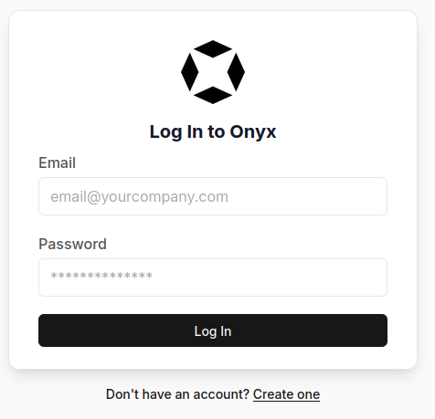
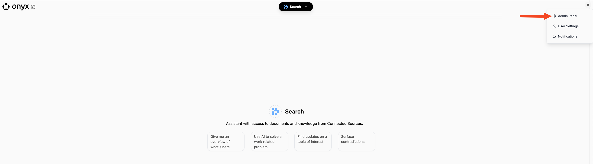
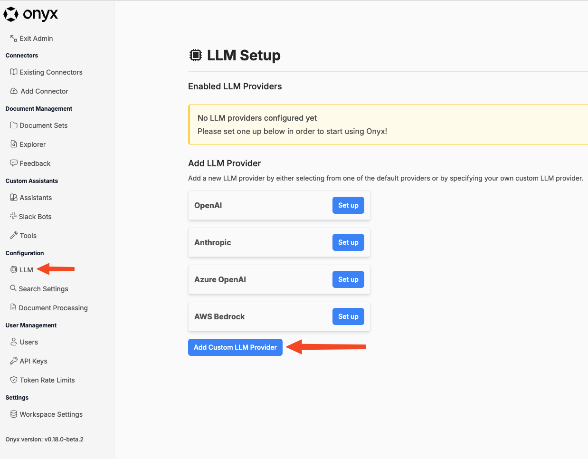
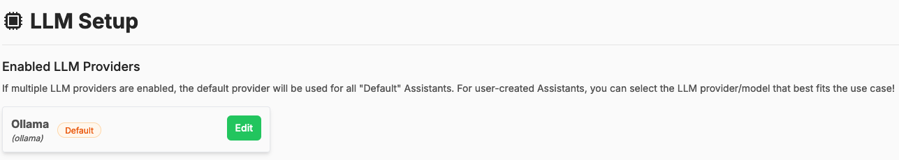
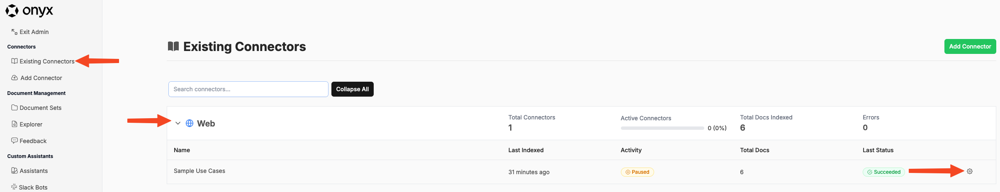
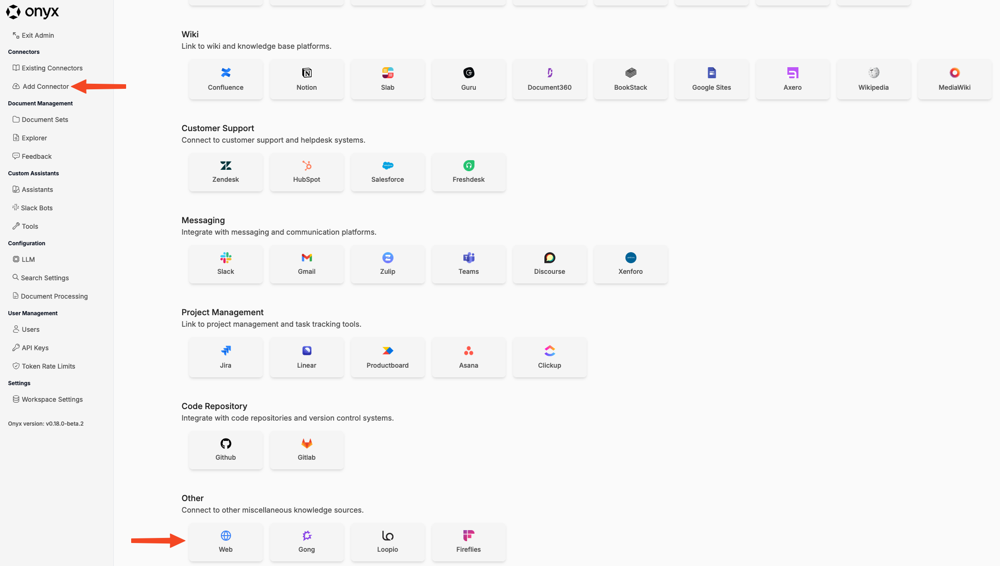
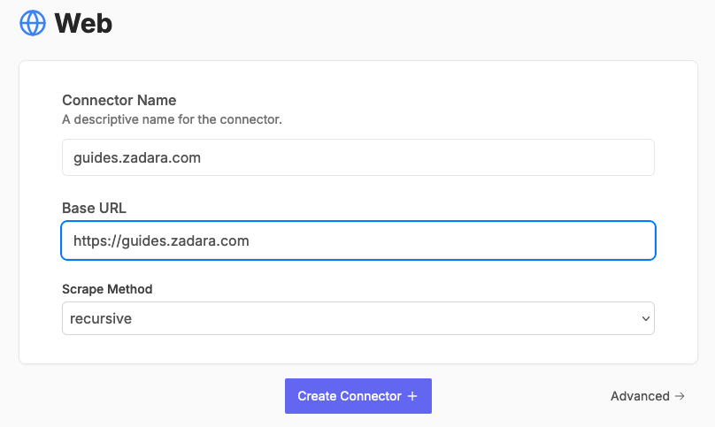
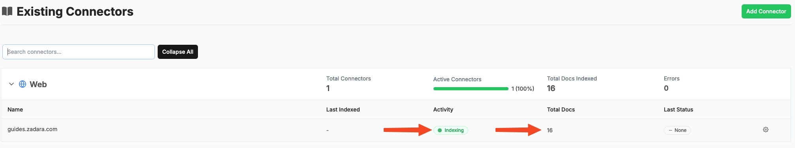

## Configuring Onyx

#### First login

In a clean installation, the first user to create an account is automatically set with Administrative permissions, and all subsequent accounts are created as standard "users".

1. Navigate to your Onyx Web Portal at `https://<public-ip>`
   * public-ip was gathered from the Load Balancer in a previous step
2. At `Don't have an account?` click **Create one**

   

3. Enter an **email address** and **password**, then click **Sign Up**.
   * SMTP is not configured in this example, be sure you know your password.
4. You will be automatically logged in and presented with a **Configure a Generative AI Model** prompt, you may close this and navigate to the same form in the Admin Panel in the next step.

#### Configuring an LLM

Onyx is able to leverage several different Generative AI Model providers according to user needs, this example is intended for self-contained operation.
This project automatically deployed `Ollama` with `llama3.1:8b-instruct-q8_0` to the same Kubernetes cluster on a GPU-enabled VM.

1. After having logged into Onyx, click on the user profile button to the top-right of the page

   

2. Navigate to **Configuration > LLM**, click on **Add Custom LLM Provider**

   

3. Fill out the form to configure Onyx to use Ollama as deployed within the Kubernetes Cluster
   * **Display Name** - `Ollama`
   * **Provider Name** - `ollama`
   * **[Optional] API Base** - `http://ollama.ollama.svc.cluster.local:11434`
   * **Model Names** (click Add New) - `llama3.1:8b-instruct-q8_0`
   * **Default Model** - `llama3.1:8b-instruct-q8_0`
   * Click **Enable**
4. Onyx will then test to confirm it's connection to Ollama and close the form
   * The model listed above is preloaded by this projuect by default, but can be changed for other usecases if necessary
   * It is possible for this to "fail" if Ollama is still actively downloading the Model, inwhich the form will remain open. Wait a few minutes and try again.
5. Assuming the success, the LLM will appear in the list as follows

   

#### Adding connector(s) to your data

Onyx, and LLM RAG in general, works by embedding your custom internal data into vectors and inserting into a vector database called `Vespa`.  To facilitate this, Onyx comes with a series of built int “connectors” that can directly connect with external sites and services via their APIs and insert the data into the vector database with all corresponding metadata preserved.  For example, if the Confluence connector is used, it will not only embed and store the contents of a Confluence article, but it will also store metadata about that article such as the date it was last updated.

Which connectors are used is based on the source of the internal data you need.  If a native connector exists for that external source, it should be used.  If not, there are a couple of “generic” connector types:

* `File` - generic files like text, markdown, pdfs, Microsoft Word documents, etc. can be uploaded and indexed with this connector.
* `Web` - this connector will crawl a website and index all documents it finds.

For a reference of connector types and their configurations, refer to the [Onyx documentation](https://docs.onyx.app/connectors/overview)

#### Optional: Remove "Sample Use Cases" Connector

Onyx comes bundled with an index of their documents site.  You can remove this if you do not need it.

1. Click “Existing Connectors” on the left, then expand the “Web” connector with the arrow if necessary, then click the gear icon to the right of “Sample Use Cases”:

   

2. Then click **Delete**:

   

#### Example: Scrape Zadara Guides

1. Click “Add Connector” on the left, then scroll down and click on the “Web” connector:

   

2. Enter any descriptive name you want, the URL `https://guides.zadara.com`, and set the scrape mode to `recursive` so it will crawl the entire site, and click “**Create Connector**”:

   

3. The state will go to Indexing, then the Total Docs counter will gradually increase while it makes its way through scraping and indexing the entire site:

   

4. Finally the state will go to `Succeeded` upon a successful completion.
