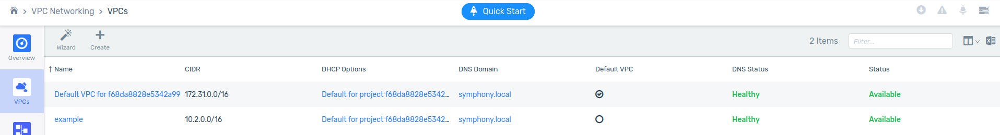
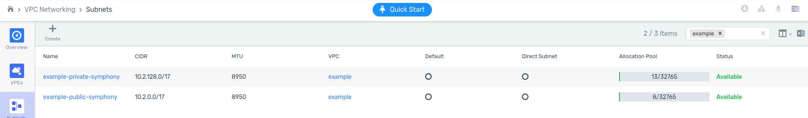
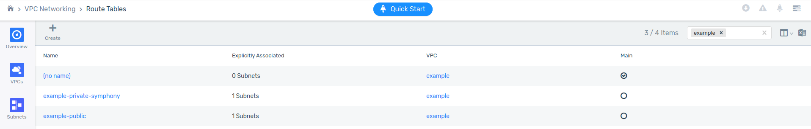
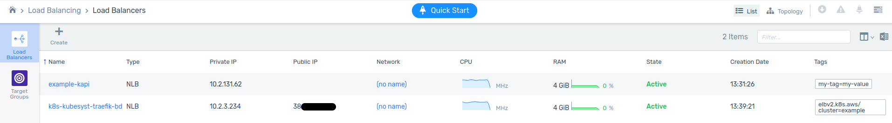
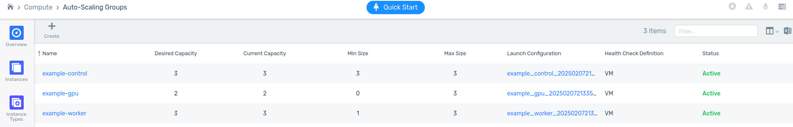
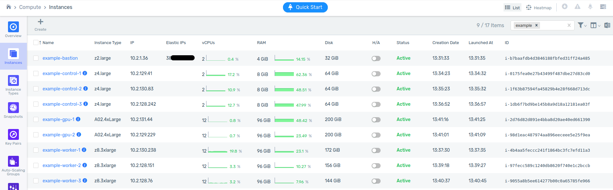

# Infrastructure Overview - zCompute

## Networking

### VPC

A dedicated VPC is created using a IP range provided by the user.



### Subnets



#### Public subnet

A public subnet is created using an IP range inside the VPC range provided by the user. It is directly attached to an Internet Gateway and should be used for any resources that need direct incoming access from the Internet. The bastion VM and incoming load balancer for the Kubernetes Ingress controller exist here.

#### Private subnet

A private subnet is created using an IP range inside the VPC range provided by the user. It uses a NAT Gateway for outgoing access to the Internet, and no incoming access is allowed as it is not attached to an Internet Gateway. The Kubernetes cluster and Kubernetes API load balancer exist here.

### Route Tables



#### Public Route Table

A route table for the public subnet is created to route internal VPC traffic and outgoing traffic through the Internet Gateway.

#### Private Route Table

A route table for the private subnet is created to route internal VPC traffic and outgoing traffic through the NAT Gateway.

### Gateways

#### Internet Gateway

An Internet Gateway is created to route outgoing traffic to the Internet for the public subnet.

#### NAT Gateway

A NAT gateway is created for outgoing Internet access from the private subnet.

### Security Groups

Four security groups are created by Terraform. More may be created by Kubernetes.

* `bastion` - this allows SSH to the bastion VM from the IP range provided by the user.
* `k8s`, `k8s_control`, `k8s_<gpu_model>`, `k8s_worker` - controls inter-VPC access.

### Load Balancers



#### kapi

This is the internal load balancer for the Kubernetes API service (TCP/6443).   
This load balancer is maintained by Terraform and used by all the Kubernetes members to interact with the internal API.

#### Traefik
This is the Internet facing load balancer for the Kubernetes Ingress controller Traefik, which will be responsible for exposing web applications to the Internet.   
This load balancer is maintained by the Kubernetes cluster itself when the cluster has progressed far-enough in it’s standup process.

## Autoscaling Groups



These projects launch 3 ASGs by default, their use is summarized under Instances.

## Instances



### Bastion

This instance is directly launched by Terraform, and behaves outside the scope of Kubernetes.

Use this host to connect to any instances inside the private subnet (e.g. all the Kubernetes instances). This host will be injected with an SSH key provided by the user. This VM is auto assigned an elastic IP and can be connected via SSH from the IP range provided by the user.

In the below example, the user can connect to the first control node by using the bastion as a jump host:
```
PEM_KEY_PATH=~/.ssh/id_rsa
BASTION_PUBLIC_IP=<>
CONTROL_NODE_IP=<>
ssh -oProxyCommand="ssh ubuntu@${BASTION_PUBLIC_IP} -i ${PEM_KEY_PATH} -W %h:%p" \
    -i ${PEM_KEY_PATH} ubuntu@${CONTROL_NODE_IP}
```

### Control

The `k3s` control nodes. These VMs are spawned by an Auto Scaling Group, and 3 are always requested for high availability.

### Worker

Kubernetes worker nodes for general workloads that only need CPU to operate. A minimum of one is always present, and will scale up and down as workload dictates.

### GPU

Kubernetes worker nodes for GPU specific workloads like `ollama` and the embedding models. The minimum is zero and will scale up as GPU resources are requested. These workers have NVIDIA’s driver and container runtime installed at boot time with cloud-init.

A dedicated Auto Scaling Group is created for each desired GPU type. For example, three ASGs could be created: `a16`, `a40`, and `l40s` - each corresponding to the model of NVIDIA GPU card. Which instance types are preferred is a combination of node affinity and the amount of GPU memory requested.

GPU nodes have a Kubernetes taint applied: `"nvidia.com/gpu" = "true:NoSchedule"`. Workloads that need to run on GPU workers need to tolerate this taint.
