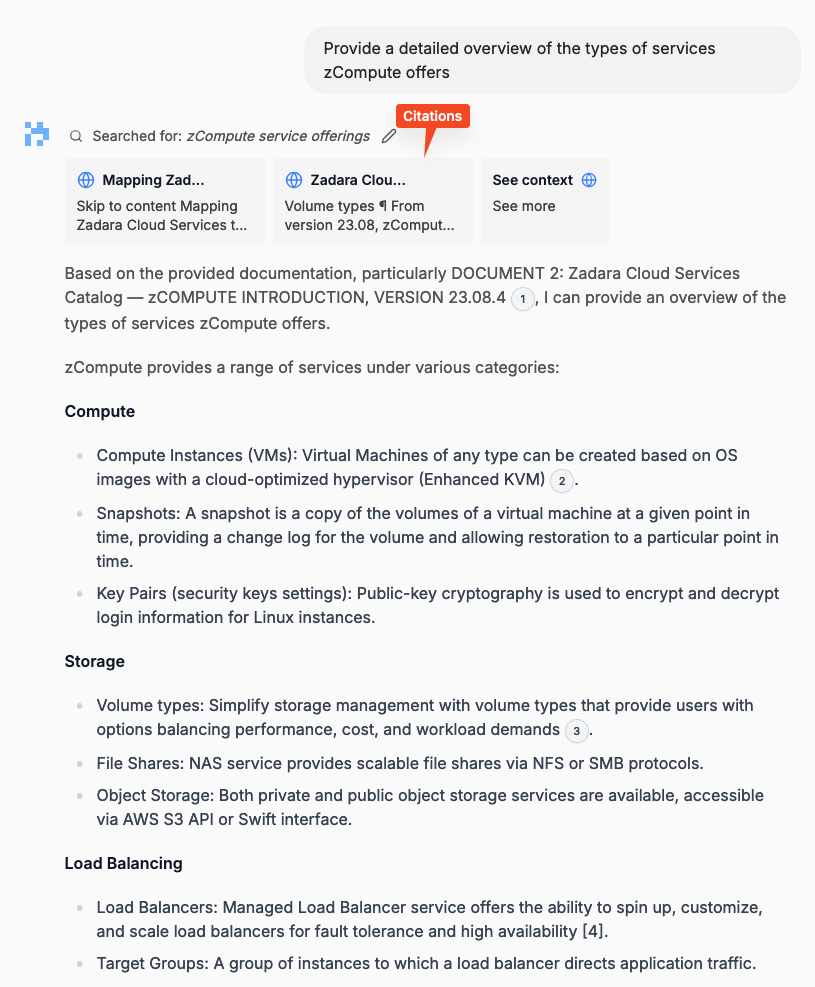
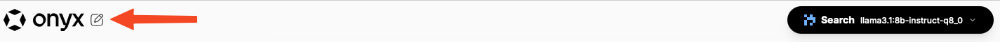

## Interacting with Onyx

Once Onyx has completed processing any configured connectors, that information is available for regular use.

Head back to the front page of Onyx by clicking **Exit Admin** in the left navigation.

### Chat modes

From the top of the page, the current chat mode can be selected:

It is important to understand what the modes are:

* **Search** - this is the main mode you should be using if you are trying to get custom answers from the internal data you have ingested using the connectors you’ve configured.
* **General** - this is just a general LLM chat bot, similar to what you might use ChatGPT for, using the general LLM model that was configured above - use this if you just want to ask generic questions not specific to your company.

We will be focusing on **Search** mode by default to utilize data collected.

### Ask a question

You can now ask any question about the data you ingested.  Keep in mind, as with any LLM, **the more specific the question, the higher likelihood of getting a more specific answer**.  Within several seconds, it should start to reply.  Note that it provides links to the documents it cites - these are hyperlinks you can click to go straight to the cited page(s):

### Contextual Chat

It is important to note that each chat session is contextual, meaning when you ask a question, then a follow up question, it will use the previous questions and answers as context for its new answer.  If you want to ask a whole new set of questions, click the “New Chat” pencil icon on the upper left:

